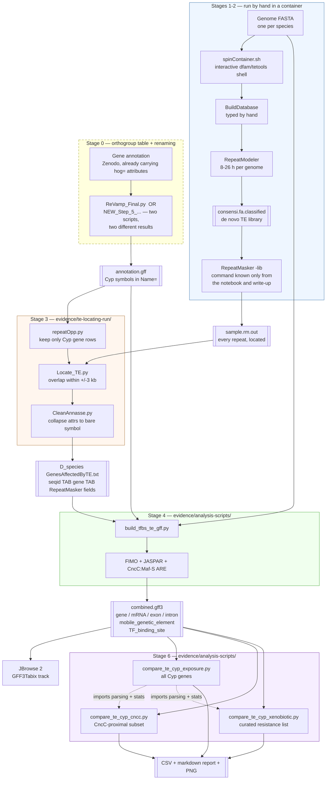
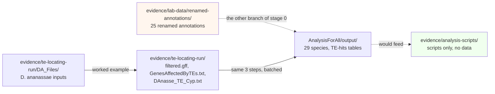

# End to end

The pipeline as it ran, on one page. Stage names here are the lab's own work; the boxes are
labelled with where the evidence for each now sits.

## The whole pipeline

## The two seams

**The dashed box, stage 0, is where two people diverged.** The annotation feeding stage 3 has
to carry *D. melanogaster* Cyp symbols in `Name=`, and two scripts produced that: Duy's
`ReVamp_Final.py` and Ayush's `NEW_Step_5_…`. They do not agree, nothing ever chose between
them, and the 29 finished tables are a mix — 19 from one, 7 from the other. See
[`../scripts/06-final-final-gff.md`](../scripts/06-final-final-gff.md).

**The RepeatMasker box is where the sources conflict.** `runMasker.sh` has been recovered and
does not match the lab notebook *(OCR doc 02)* or the write-up *(OCR doc 05)*, which agree
with each other. The diagram shows what those two describe, because that is what is consistent
with the surviving `.out` files. See
[`../pipeline/detailed/02-stage-reference.md`](../pipeline/detailed/02-stage-reference.md).

## Where the surviving data sits on that path

The archive contains **one fully worked example** (*D. ananassae*, every intermediate
preserved), **29 finished TE-hits tables** and **25 renamed annotations** — but no combined
GFF3 and no comparison output at all. Stages 4 and 6 left nothing behind: their inputs
survive, their outputs do not, and the lab's own results spreadsheet (`TEandTFdata.xls`) is
not in the archive either.
