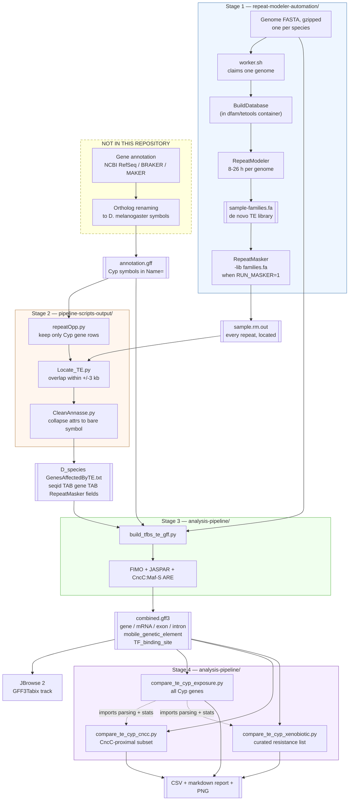
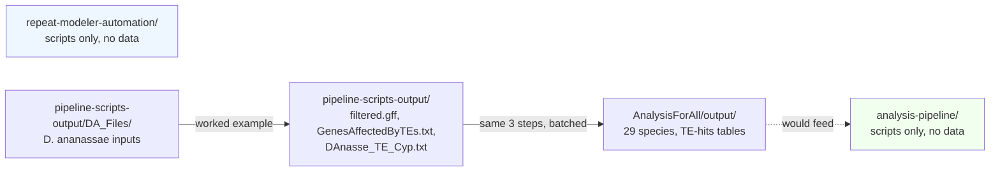

# End to end

## The whole pipeline

## The seam

The dashed box is the important part of this diagram — and it is smaller than it used to be.

Stage 1 produces a TE *library*: a catalogue of repeat families found in a genome, which does
not say where in the genome they are. Turning that library into per-locus coordinates is
RepeatMasker's job, and **RepeatMasker is now run by the same workers**, as a second stage
gated on `RUN_MASKER=1`. A genome FASTA therefore reaches `sample.rm.out` without leaving this
repository. (The lab's own `runMasker.sh`, known from the archive photographs — see
`OCR docs/02` — was never committed, and is superseded rather than recovered.)

**One required step still has no code here**: the annotation GFF whose `Name=` attributes are
already *D. melanogaster* Cyp symbols. Producing that was the job of `ReVamp_Final.py` /
`NEW_Step_5_Replace_gff_Names_with_Dmelanogaster_1_9.py`, neither of which was committed. Both
have since been recovered into `to_organize/` — see
[`../deep/06-final-final-gff.md`](../deep/06-final-final-gff.md).

So: with genomes alone you now get all the way to a located-repeat table. To go further you
also need a renamed `*.gff` for that species — existing species have one, a new species would
not.

## Where the data in this repository sits on that path

The repository contains **one fully worked example** (*D. ananassae*, every intermediate
preserved) and **29 finished TE-hits tables**, but no combined GFF3 and no comparison
output. Stage 3 and Stage 4 have never been run on the committed data — their inputs are
present, their outputs are not.
