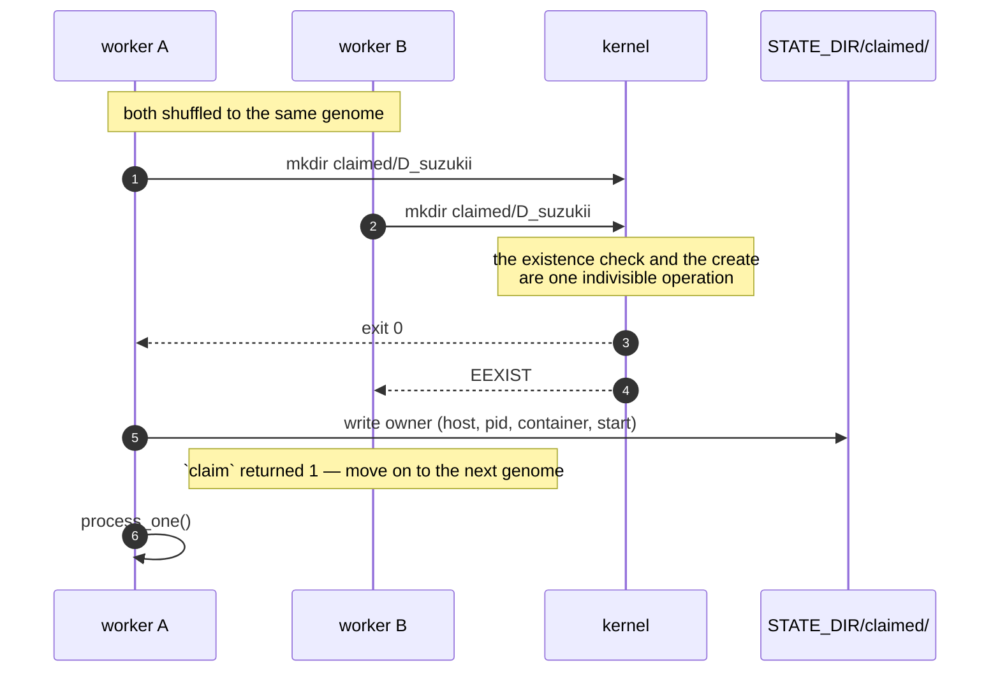
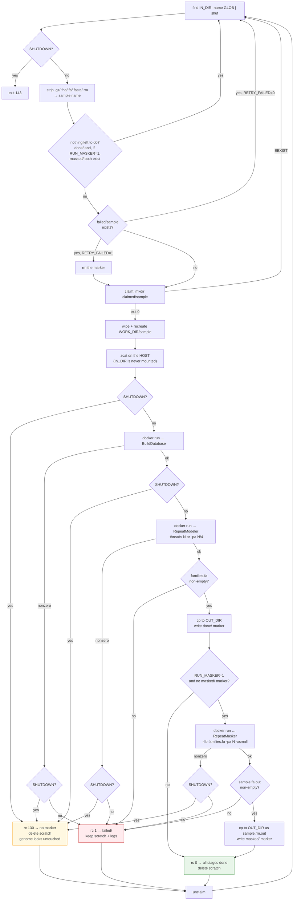
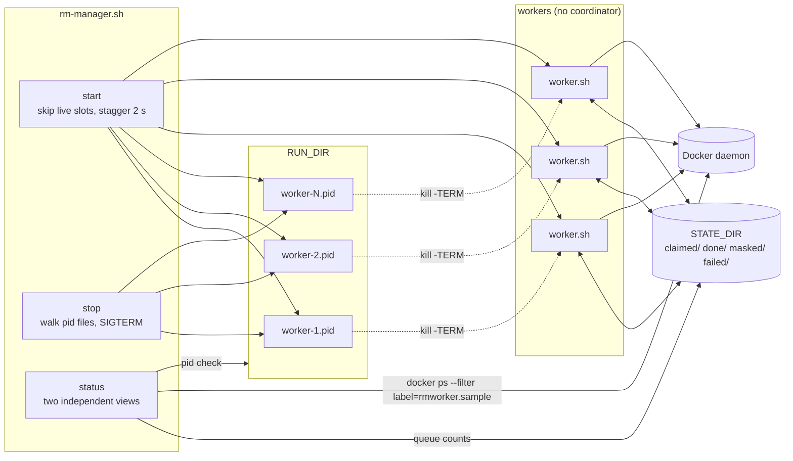

# Worker concurrency and genome state

> **Not the lab's code, and not in this repository.** This diagram describes
> `repeat-modeler-automation`, written in September 2026 to replace the lab's manual
> RepeatModeler sessions and since split into its own repository. It is kept here because the
> state machine is the clearest statement of what an 8–26 hour per-genome run demands. The lab
> itself had none of this: a person opened a terminal per species and waited — see
> [`../pipeline/detailed/02-stage-reference.md`](../pipeline/detailed/02-stage-reference.md).

## Every state a genome can be in

State lives entirely in **directory names** under `$STATE_DIR`. Nothing is ever read to
decide what to work on next, so there is no file for workers to disagree about.

```mermaid
stateDiagram-v2
    [*] --> Available: genome file exists in IN_DIR

    Available: <b>available</b><br/>has an unfinished stage, not claimed or failed<br/>(recomputed every pass, never recorded)
    Claimed: <b>claimed/&lt;sample&gt;/</b><br/>owner file records host + pid + container
    Done: <b>done/&lt;sample&gt;</b><br/>families file is in OUT_DIR<br/>still available for the mask stage
    Masked: <b>masked/&lt;sample&gt;</b><br/>sample.rm.out is in OUT_DIR
    Failed: <b>failed/&lt;sample&gt;</b><br/>scratch dir and log kept

    Available --> Claimed: mkdir succeeded<br/>(exactly one winner)
    Claimed --> Done: rc 0
    Claimed --> Failed: rc 1
    Claimed --> Available: rc 130 — SIGTERM<br/>no marker written
    Claimed --> Available: reap_stale_claims()<br/>owner pid is dead on this host

    Failed --> Available: RETRY_FAILED=1<br/>or rm failed/&lt;sample&gt;
    Done --> Masked: RUN_MASKER=1<br/>RepeatMasker succeeded
    Done --> Available: rm done/&lt;sample&gt;
    Masked --> Available: rm masked/&lt;sample&gt;<br/>re-masks, no re-modelling

    Done --> [*]
```

The fourth state has no marker of its own — **available is the absence of the other three**.
That is what makes `rm state/done/GCA_002110` a complete way to redo one genome — and
`rm state/masked/GCA_002110` a way to redo only its RepeatMasker run, keeping the library that
took 8-26 hours to build.

Note that a genome in `done/` is **not** necessarily finished. With `RUN_MASKER=1` it stays
available for the mask stage until `masked/` exists too, which is what lets you enable masking
after a modelling run and have the existing genomes picked up without re-modelling them.

## Why `mkdir` is the lock



There is deliberately **no `if [ -d ... ]` test** before the `mkdir`. Adding one would
reintroduce exactly the race the design exists to avoid: between the test and the create,
another worker can win.

The `done/` and `failed/` checks in the main loop *are* allowed to be stale — they only
skip pointless `mkdir` attempts. The `mkdir` is the one step whose answer is authoritative.

> **`STATE_DIR` must be on a local filesystem.** `mkdir` atomicity is not dependable over
> NFS, and the entire scheme rests on it.

## One genome, start to finish



The three outcomes are handled differently on purpose, and the middle one is the subtle one:

- **success** → marker written, scratch deleted
- **failure** → marker written, scratch and log **kept** so you can see what happened
- **abort** (rc 130, a clean SIGTERM) → **no marker**, scratch deleted. The genome looks
  untouched and the next run picks it up.

Without the `(( SHUTDOWN )) && return 130` checks after each container call, every clean
shutdown would wrongly mark its in-flight genome *failed* — because stopping the container
makes `docker run` exit non-zero, which is indistinguishable from a real failure unless you
check whether *you* were the one who stopped it.

## Supervisor and workers



`rm-manager.sh` holds no state beyond pid files. The workers coordinate with each other
through `$STATE_DIR` alone — which is why a worker you started by hand and one started by
the manager behave identically, and why `status`'s queue counts are accurate either way.

`status` deliberately reports **two views that can legitimately disagree**: which worker
*processes* are alive (from pid files) and what the *queue* looks like (from the state
directories). A "dead (stale pidfile)" line next to a non-zero `running` count means a
worker was killed hard and its claim is still sitting there, waiting to be reaped the next
time any worker starts.
