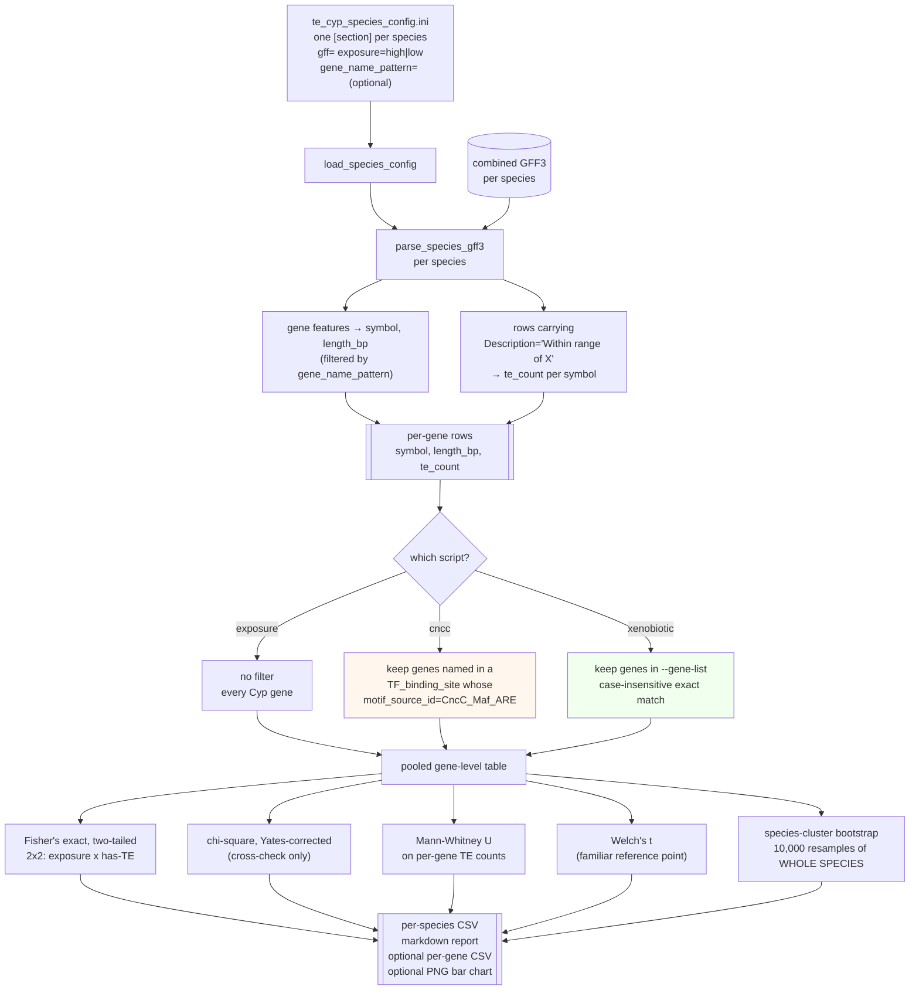
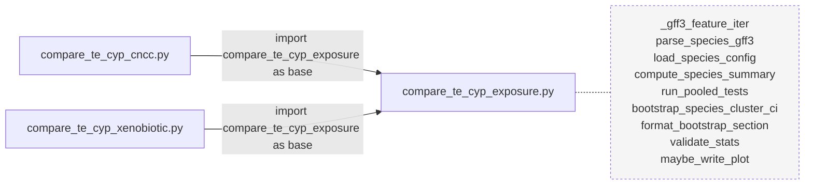
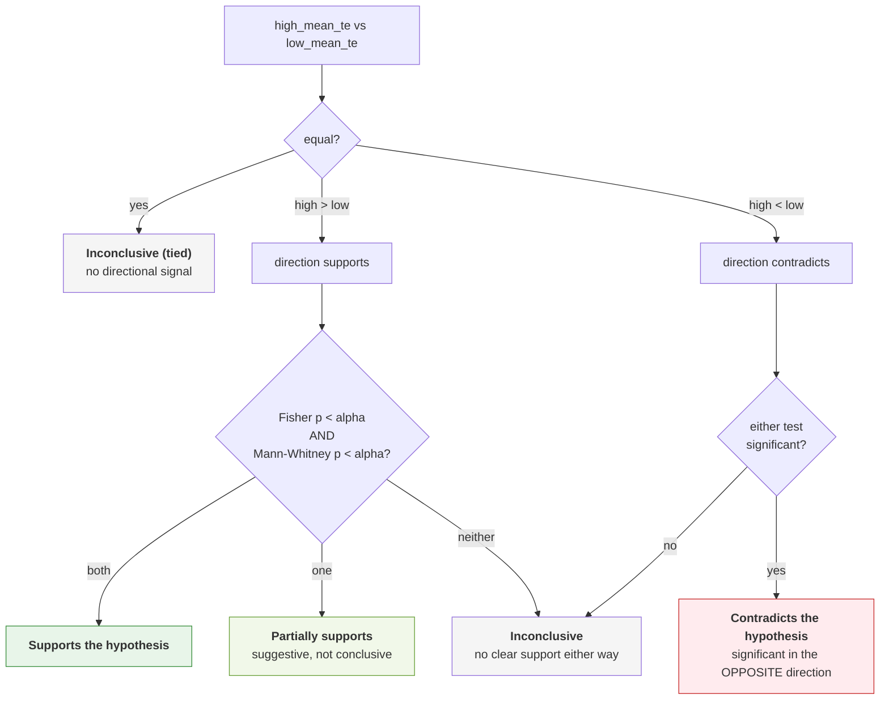
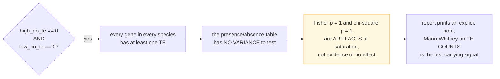
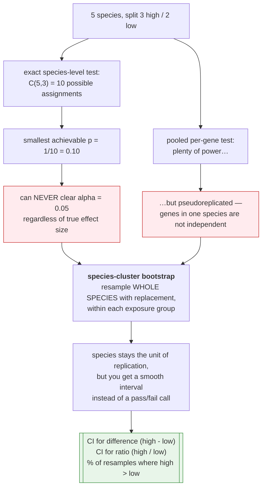
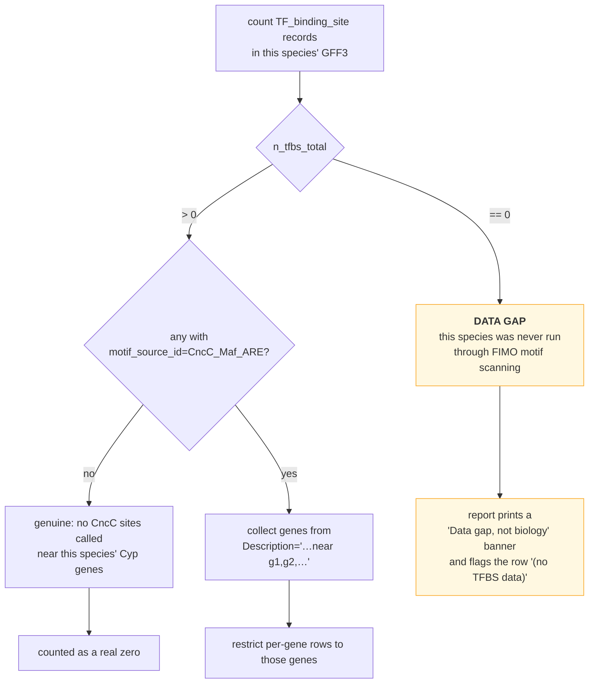

# The three comparisons

## Shared skeleton, three gene filters

All three scripts read the same combined GFF3 files, through the same config file, and run
the same statistics. The **only** thing that differs is which Cyp genes survive into the
pooled table.

## Import relationship

> The three files as delivered are named `compare_te_cyp_exposure 1 1.py`,
> `compare_te_cyp_cncc 1 1.py` and `compare_te_cyp_xenobiotic 1 1.py`. **The imports cannot
> resolve against those names.** Rename them to drop the suffix before running anything.

## Verdict logic

Both the significance calls and the direction call feed one decision. Direction is judged
from **mean per-gene TE burden**, never from the 2×2 table — because that table can be
fully saturated and would then cross-multiply to a meaningless direction.

### The saturated-table case

This is not a hypothetical. Cyp genes in *Drosophila* are frequently TE-adjacent, and a
±3 kb proximity rule (Stage 2) catches simple repeats and low-complexity regions as well as
real transposons — so "does this gene have ≥1 TE?" saturates easily. The count-based test
is the one that discriminates.

## Why the bootstrap exists

The "inconclusive" verdicts this pipeline tends to produce are very likely a consequence of
that 0.10 floor, not of a small effect. The bootstrap reports a **directional confidence
statement** ("83.4% of 10,000 species-resamples showed higher TE/gene in high-exposure
species") which is honest about what five species can and cannot tell you.

## CncC data gap versus real zero

Distinguishing these two is the reason `parse_cncc_associated_genes` returns
`n_tfbs_total` alongside the gene set. Without that count, "0 CncC-proximal genes" would be
indistinguishable from "we never looked".
