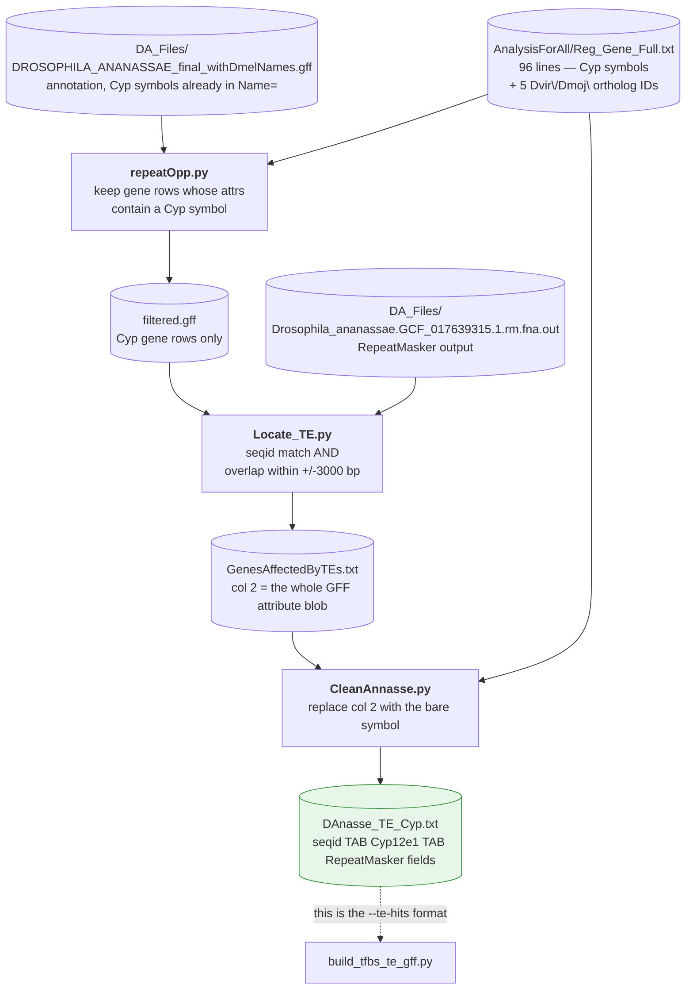
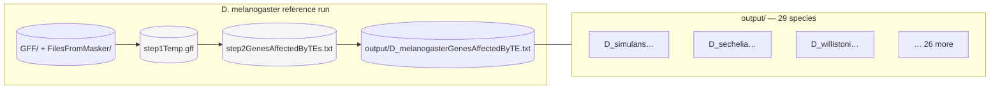
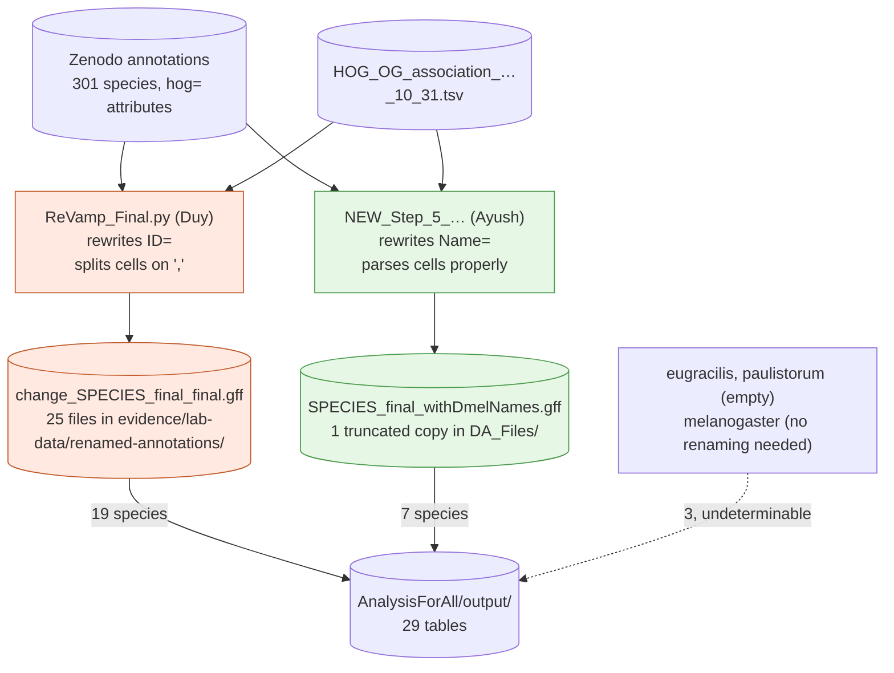
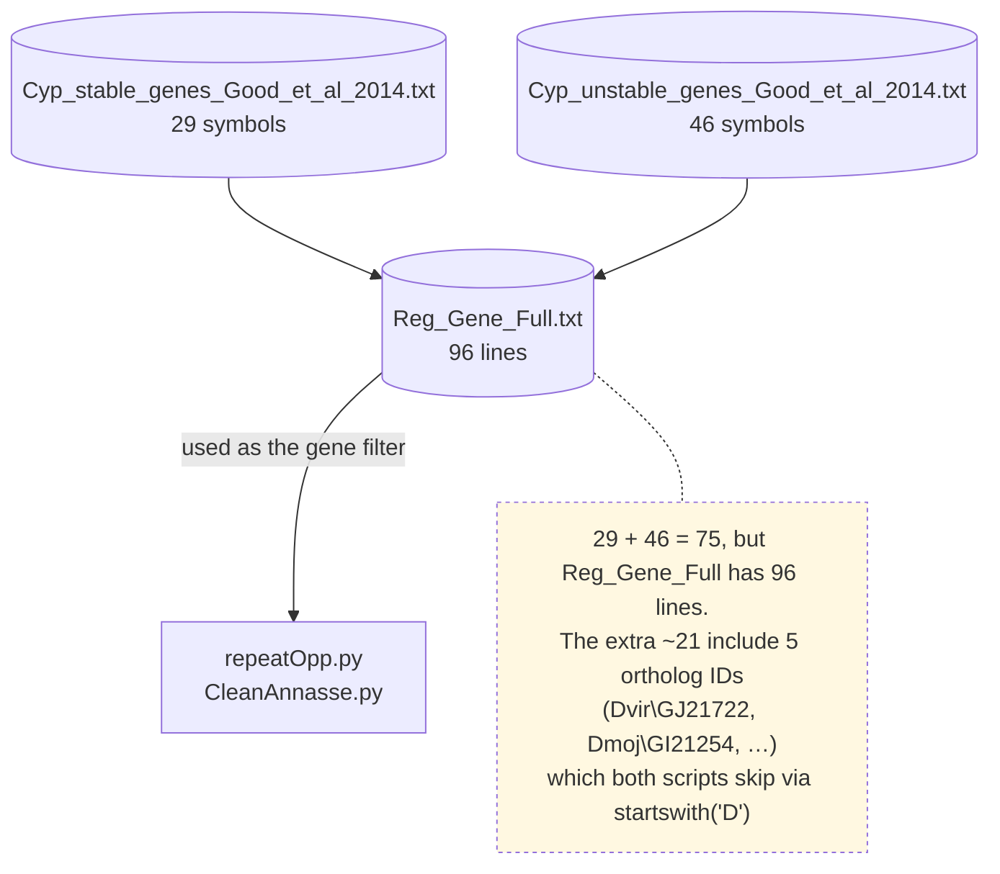
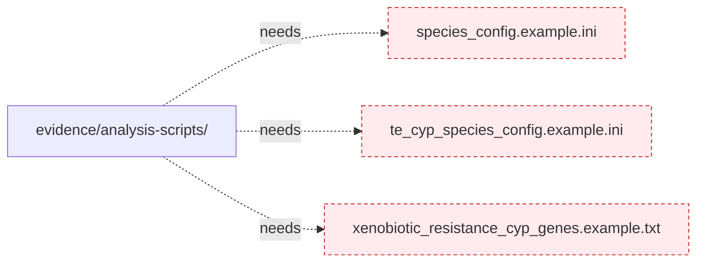

# Data lineage

Every data file in the archive, and what produced it.

## The *D. ananassae* worked example

`evidence/te-locating-run/` preserves one species end to end — every intermediate, in order.
It is the best available specification of what this stage did, because the files can be
diffed against each other.



The transformation `CleanAnnasse.py` performs is visible in one line. Before:

```
NC_057927.1	Name=Cyp12e1;ID=gene-G00000000064;Name_old=LOC6500252;dbxref=…	   13   28.7  1.4  4.5  NC_057927.1    846413   846481 …
```

After:

```
NC_057927.1	Cyp12e1	   13   28.7  1.4  4.5  NC_057927.1    846413   846481 …
```

That is the whole point of the third script: collapse a 300-character attribute string into
the bare gene symbol, because `build_tfbs_te_gff.py` reads column 2 as a symbol.

## The 29-species batch

`AnalysisForAll/` is the same three steps applied across species, with the *D. melanogaster*
intermediates left in place as the reference run.



`step1Temp.gff` and `step2GenesAffectedByTEs.txt` are the same artifacts as `filtered.gff`
and `GenesAffectedByTEs.txt` above, under batch-run names — confirming the three-step shape
was stable across both runs.

## The split upstream of the batch

The 29 tables did not all come down the same path. The annotation each one started from was
produced by one of **two different renaming scripts**, written independently by two people,
which do not agree with each other:



The red path loses roughly 7% of orthologous genes — every gene in an orthogroup cell that
lists more than one — so the 19 tables on that branch under-count Cyp loci in exactly the
multi-copy gene families the study is about. Neither the tables nor anything else in the
archive records which branch a given species took; the attribution above was reconstructed by
asking, for every TE row, which renamed annotation could account for it.

Full working: [`../scripts/06-final-final-gff.md`](../scripts/06-final-final-gff.md).

## Reference gene lists



The `startswith("D")` skip in `repeatOpp.py` and `CleanAnnasse.py` exists to drop those
`Dvir\`/`Dmoj\` prefixed ortholog identifiers. It is a blunt instrument — it would also
silently drop any Cyp symbol beginning with a capital D — but no such symbol exists in
these lists.

"Stable" and "unstable" refer to Good et al. 2014's classification of Cyp gene copy-number
stability across *Drosophila*. Both lists are merged for filtering; the distinction is not
used by any surviving script.

## What is missing



All four scripts reference these three example files by name in their docstrings, help text
and error messages. **None of them are in the archive** — nor are the real configs those
templates were for, which means the exact species-to-exposure-group assignment the lab used is
not recorded anywhere. The formats themselves are reconstructable, and are specified in
[`../pipeline/detailed/03-data-contracts.md`](../pipeline/detailed/03-data-contracts.md).
