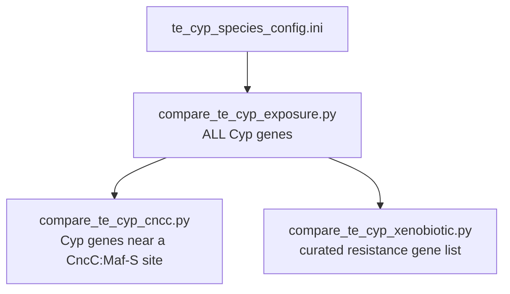

# Stage reference

One section per stage: what went in, what command ran, what came out, how long it took, and
what went wrong. File formats are specified separately in
[`03-data-contracts.md`](03-data-contracts.md).

Legend, describing **what survives of each stage**:

| | Meaning |
|---|---|
| **✅ recovered** | The lab's own code for this stage is in [`../../../evidence/`](../../../evidence/) and can be read |
| **⚠ partly recovered** | Some of the code survives; a piece it depends on does not |
| **❌ lost** | No code survives. The stage is known only from the archive photographs |

Nothing in this document is an instruction to run anything. Where a command appears, it is
the command the lab ran, or the command used during this investigation to check a claim.

---

## Stage 0 — Preparing the inputs ⚠

Before stage 1 could start, each species needed two things, and the second of them is where
most of this investigation went.

### 0a. Genome FASTA

Per-species assemblies, named by their NCBI accession — e.g.
`GCF_016746245.2_Prin_Dsan_1.1_genomic.fna` (*D. santomea*),
`Drosophila_ananassae.GCF_017639315.1` (*D. ananassae*).

Era 1 read these from `D:/CYP_Gene_Project/Dhakad_et_al_2025_Data_Analysis/12_species_genomes`,
described in the log as the *old* location superseded by `Spring26/` *(OCR doc 04)* — but the
JBrowse instructions and the handoff sketch both still point at the `Dhakad` tree *(OCR docs
02, 06)*, so the genome FASTAs appear never to have actually moved.

(The later automation — see the note on eras below — expects them **gzipped** in `IN_DIR`,
matching `GLOB`, default `*.fna.gz`.)

### 0b. Gene annotation GFF3 with *D. melanogaster* ortholog names ⚠

This is the important one. Each species' annotation had its gene names replaced with the
corresponding *D. melanogaster* ortholog symbols. Without that step the same gene carries a
different symbol in every species, nothing can be compared across species, and the Cyp target
list matches nothing.

**Two different scripts did this, written by two different people, and they do not agree.**
Both have since been recovered into
[`../../../evidence/lab-scripts/gene-renaming/`](../../../evidence/lab-scripts/gene-renaming/).
`ReVamp_Final.py` is taken apart, and verified by re-running it, in
[`06-final-final-gff.md`](../../scripts/06-final-final-gff.md):

| Dataset | Script | Author | Location | Date |
|---|---|---|---|---|
| Gff_Dataset#1 | `NEW_Step_5_Replace_gff_Names_with_Dmelanogaster_1_9.py` | Ayush (editing the log author's older scripts) | `CYP_Gene_Project/Spring26/Gff_Dataset#1` | 5/7/2026 |
| Gff_Dataset#2 | `ReVamp_Final.py` | Duy | `CYP_Gene_Project/Spring26/Gff_Dataset#2` | 7/9/2026 |

*(OCR doc 04; folder dates from OCR doc 03b.)*

Nothing in the log states which supersedes which. The lab notebook's step-by-step procedure
points at **Dataset #2**, so that is the one that was in active use as of August 2026
*(OCR doc 02)*.

> **Both were used, and it matters.** Attributing the 29 finished species tables back to one
> script or the other puts **19 on Duy's `ReVamp_Final.py` and 7 on Ayush's `NEW_Step_5_…`**.
> The two do not produce the same annotation: ReVamp fails to rename *any* gene in an
> orthogroup cell that lists several (about 7% of orthologous genes — 788 of 11,063 for
> *D. arizonae*), because such cells are stored quoted and space-separated and it splits on a
> bare comma. Those genes then carry no Cyp name and stage 3 never sees them. On
> *D. ananassae* the difference is 57 Cyp loci found instead of 91. Stage 6 therefore compares
> 19 species with systematically short Cyp gene sets against 7 without — see
> [`04-gaps-and-provenance.md`](04-gaps-and-provenance.md), G4, and
> [`06-final-final-gff.md`](../../scripts/06-final-final-gff.md). `Gff_Dataset#2` is only 278 KB and contains a single subfolder,
`Duy_New_Scripts` — it is a script folder, not a data folder, despite the name *(OCR doc 03b)*.

**Where the orthology itself came from.** The renaming scripts did not compute orthology;
they looked it up. The example outputs carry `dmel_orthologs=` and `hog=N1.HOG…` attributes on
mRNA records, and those attributes are already present in the published Zenodo annotations
(record 18453526). All this step did was swap a gene's own ID for the *D. melanogaster*
symbol of the same orthogroup.

**What is lost.** The HOG table itself survives
([`../../../evidence/lab-data/hog-tables/`](../../../evidence/lab-data/hog-tables/)), but the
code that would build one for a *new* species does not: `Step_2_…`'s `config.py` and
`Step_1_…`'s `Dmel_HOG_association.tsv` are both gone, and the four scripts the shell history
shows doing the original OrthoFinder post-processing
(`Grab_data_Atallah_12_2.py`, `Rewrite_gene_names.py`, `Remove_duplicates_Atallah.py`,
`Bulk_gffread.py`) exist nowhere at all.

### 0c. The Cyp target list ✅

`evidence/te-locating-run/AnalysisForAll/Reg_Gene_Full.txt` — 96 lines, one gene symbol each.

Two of its properties are load-bearing and non-obvious: it contains five entries in
`Dvir\GJ21722` form which **both** stage 3 scripts silently skip (they skip every line
starting with `D`, so the effective list is 91 symbols), and matching is *substring* matching,
not exact — see [`03-data-contracts.md`](03-data-contracts.md).

`evidence/te-locating-run/DA_Files/` also holds `Cyp_stable_genes_Good_et_al_2014.txt` and
`Cyp_unstable_genes_Good_et_al_2014.txt`, a literature-derived split of Cyp genes into
evolutionarily stable and unstable sets. **No surviving script reads them** — they are an
unused split, and plausibly a more interesting one than exposure group.

---

## Stage 1 — Build the per-species repeat library ✅

**In:** one genome FASTA. **Out:** a classified TE consensus library. **Runtime:** 8-26 h
typical, 45 h observed with `-LTRStruct`.

### As the lab ran it ✅

`spinContainer.sh` — transcribed from a terminal photograph *(OCR doc 01)*, and since
recovered as
[`../../../evidence/lab-scripts/shell/spinContainer.sh`](../../../evidence/lab-scripts/shell/spinContainer.sh),
where it matches the photograph line for line:

```bash
docker run -it --rm \
    -v $(pwd):/Spring26RepeatModeler \
    -w /Spring26RepeatModeler \
    dfam/tetools:latest bash
```

This starts an **interactive** shell — it does not run RepeatModeler. The operator then typed,
inside the container *(OCR doc 04)*:

```
BuildDatabase -name D_speciesname Species_genome_file.fa
RepeatModeler -database D_speciesname -threads 10 -LTRStruct
```

Because `-v $(pwd):...` mounts only the current species folder, running a second species meant
opening a second terminal and repeating the entire sequence. `--rm` means nothing survives
outside the mount.

### How it was replaced ⓘ *(not in this repository)*

In September 2026 the manual session was rebuilt as an unattended worker pair,
`repeat-modeler-automation/`. **That code is not the lab's and is no longer in this
repository** — it lives in its own repository and is described here only because it is the
clearest statement of what stages 1 and 2 had to do. Configuration is **entirely** in
`rmodeler.conf`; there are no
command-line options and no environment variables, and inherited environment values are
discarded before the file is read. Both scripts exit 2 if the file is missing, if a setting is
missing, if a name is misspelled, or if a value is nonsense.

```bash
cp rmodeler.conf.example rmodeler.conf && $EDITOR rmodeler.conf
docker pull dfam/tetools:latest

./worker.sh                  # one worker, foreground — good for a first run
./rm-manager.sh start        # WORKERS workers as daemons
./rm-manager.sh status       # pid check + queue counts
./rm-manager.sh stop         # SIGTERM all of them
```

Per genome the worker performs, inside the container:

```
BuildDatabase -name <sample> <sample>.fa
RepeatModeler -database <sample> <thread flag> [-LTRStruct]
```

and then, when `RUN_MASKER=1`, continues straight into stage 2 on the same genome without
releasing the claim — see [Stage 2](#stage-2--annotate-te-locations-genome-wide-).

Differences from the lab's own procedure that matter, and that say something about it:

- **No `-engine` flag**, on either call. Current RepeatModeler (checked against 2.0.9) removed
  the option from `BuildDatabase`, so passing it is a hard `Unknown option: engine` failure.
- **The thread flag is detected at runtime** (`-threads` vs the older `-pa`) rather than
  assumed.
- **Decompression happens on the host**, so `IN_DIR` is never mounted into the container — a
  container only ever sees one genome's scratch directory.
- **The result is verified, not assumed.** RepeatModeler can exit 0 having produced nothing
  usable, so the worker checks that `<sample>-families.fa` is non-empty before declaring
  success.

### Outputs

| Path | Meaning |
|---|---|
| `$OUT_DIR/<sample>-families.fa` (and `.stk`) | The library. The only artifact that leaves the stage |
| `$STATE_DIR/done/<sample>` | Finished successfully |
| `$STATE_DIR/failed/<sample>` | Failed; scratch dir and log kept for inspection |
| `$STATE_DIR/claimed/<sample>/owner` | In progress; records host + pid |
| `$LOG_DIR/<sample>.log` | Full BuildDatabase/RepeatModeler output |
| `$WORK_DIR/<sample>/` | Scratch; deleted on success unless `KEEP_WORK=1`, kept on failure |

The lab's equivalent output was `consensi.fa.classified`, alongside `families.stk`, `rmod.log`,
`round-1`…`round-5`, `genome.2bit` and assorted `tmp*` files *(OCR doc 03c)*, all of which are
listed by name in
[`../../../evidence/lab-environment/listing.txt`](../../../evidence/lab-environment/listing.txt).
Modern
RepeatModeler names the same artifact `<sample>-families.fa`. **Both names refer to the same
thing** — the classified consensus library — and downstream documentation uses them
interchangeably.

### Sizing and failure modes

Total cores ≈ `WORKERS × THREADS`; on a 24-core / 124 GB box, `WORKERS=4` / `THREADS=6` is the
documented starting point. `WORK_DIR` runs **20-80 GB per genome in flight**.

- `STATE_DIR`/`WORK_DIR` on NFS → claim races become possible. Use local disk.
- `LTRSTRUCT=1` roughly doubles wall time and disk.
- A cgroup OOM kill from `MEM_LIMIT` looks like an ordinary failure in the log — check `dmesg`
  before believing one.
- Never `kill -9` a worker: it orphans claims and containers. They are recoverable on the next
  startup, but `status` is misleading until then.

---

## Stage 2 — Annotate TE locations genome-wide ⚠

**In:** the stage 1 library + the genome FASTA. **Out:** a RepeatMasker `.out` table.
**Runtime:** typically an hour or two.

A script called `runMasker.sh` has been recovered, and it does **not** do what every other
source says this stage did. Read "As the lab ran it" below before anything else in this
section.

### How it was replaced ⓘ *(not in this repository)*

In the September 2026 automation, stage 2 is part of the same worker as stage 1, not a
separate tool. Set `RUN_MASKER=1` in
`rmodeler.conf` and each worker masks every genome straight after it models it, in the same job
directory, using the library it just built:

```
RepeatMasker -lib <sample>-families.fa -pa $THREADS -xsmall <sample>.fa
```

| Flag | Why |
|---|---|
| `-lib` | Makes this a **custom library** run — the repeats annotated are the ones stage 1 discovered in this genome, not Dfam's stock set for the clade |
| `-pa $THREADS` | RepeatMasker's own parallelism. Unlike RepeatModeler there is no `-threads` spelling to detect; the container's `--cpus` ceiling applies on top |
| `-xsmall` | Soft-masks — repeats come back lowercased rather than replaced with `N`, so the masked FASTA is still usable as sequence for downstream motif scanning. No effect on the `.out` table |

**Outputs**

| Path | Meaning |
|---|---|
| `$OUT_DIR/<sample>.rm.out` | The annotation table. **This is what the rest of the project consumes.** It is RepeatMasker's own `<sample>.fa.out`, renamed on the way out so the role is visible |
| `$OUT_DIR/<sample>.rm.tbl` | RepeatMasker's summary table |
| `$OUT_DIR/<sample>.rm.masked.fa` | The soft-masked genome — only when `KEEP_MASKED_FASTA=1`, since it is as large as the genome |
| `$STATE_DIR/masked/<sample>` | Marker: masking finished successfully |
| `$LOG_DIR/<sample>.masker.log` | Full RepeatMasker output |

**Stage independence.** `done/` (modelled) and `masked/` are separate markers, and this is the
design point rather than an implementation detail:

- Turning `RUN_MASKER=1` on **after** a modelling run re-runs only RepeatMasker over the
  already-modelled genomes. The library is copied back from `$OUT_DIR`, which is the only place
  it survives once the job directory is deleted.
- A mask that fails keeps the `done/` marker and the library, so the retry costs one
  RepeatMasker run rather than another 8-26 hours.
- A SIGTERM mid-mask is an **abort**: no marker is written and the stage looks untouched next
  pass. It is never recorded as a failure.
- The stages log to separate files so a mask-only retry cannot truncate the RepeatModeler log
  belonging to the library it is using.

If the library is missing entirely — `done/` marker present but `<sample>-families.fa` gone —
the worker fails that genome with an explicit message rather than silently re-modelling it.
Clear `done/<sample>` to rebuild from scratch.

### As the lab ran it ⚠ — three sources, and they disagree

**Source 1: the recovered script.**
[`../../../evidence/lab-scripts/shell/runMasker.sh`](../../../evidence/lab-scripts/shell/runMasker.sh)
turned up in the lab archives. In full, it is one blank line and one command:

```bash
RepeatMasker -lib GFF_Files/Dataset_1_12_species/DROSOPHILA_PAULISTORUM_final.gff
```

Three things are wrong with it as a stage-2 invocation:

- **`-lib` points at a gene annotation GFF**, not at a repeat library. RepeatMasker expects a
  FASTA of consensus sequences there. A GFF is not one.
- **There is no genome FASTA argument at all**, so RepeatMasker has nothing to scan.
- **There is no `-pa`**, which the notebook explicitly records.

As saved, this script cannot have produced any of the `.out` files in this repository. What it
*is* remains open. The most economical reading is that it was edited per-run in exactly the
way the Python scripts were — one path swapped in before each species — and this is simply the
state it was last left in, during some unrelated experiment on the Dataset #1 annotations. The
filename in it, `DROSOPHILA_PAULISTORUM_final.gff`, is suggestive: *D. paulistorum* is one of
the two species whose finished TE table is **empty**.

That reading is not established. What is established is that **the recovered script is not the
command that produced the data**, and that the only records of the real command are the two
below.

**Source 2: the command** — lab notebook *(OCR doc 02, section 1)*:

```
Repeatmasker:
• After repeat modeler RM file w/date  Data D.
• consensi.fa.classified
• RepeatMasker
• Copy & paste replace Drosophila_…  w/ file
• RepeatMasker -lib RM_#$date/consensi.fa.classified -pa 8  Drosophila_ .fna file
```

`RM_#$date` stands for the dated RepeatModeler output directory — the real thing looks like
`RM_235549.ThuJul92144222026` *(OCR doc 03c)*, and such directories are listed by name in
[`../../../evidence/lab-environment/listing.txt`](../../../evidence/lab-environment/listing.txt).
"Copy & paste replace Drosophila_… w/ file" is an instruction to substitute the species
filename by hand each time. **Treat the flag order as approximate**; it is a handwritten
paraphrase.

**Source 3: the procedure** — Kaur write-up *(OCR doc 05, pages 2-3)*:

> 1.) Copy the RepeatModeler output (consensi.fa.classified) into the RepeatMasker folder (it
>     should already be there from when we ran RepeatModeler).
> 2.) Run RepeatMasker using the custom repeat library and the genome FASTA file.
> 3.) Save the output files for downstream analysis.

The parenthetical in step 1 is the operationally significant detail — RepeatMasker ran **in the
same per-species working directory as RepeatModeler**, so the library was already in place and
nothing was copied anywhere. The later automation does the same thing, for the same reason.

Sources 2 and 3 agree with each other and with the shape of the surviving `.out` files. Source
1 agrees with nothing. Since the notebook and the write-up are independent of each other, the
custom-library run they both describe is what is taken as the real stage 2 throughout this
documentation.

### Which container did this run in?

**The same image, not a separate one.** `dfam/tetools:latest` bundles RepeatMasker alongside
RepeatModeler, RECON, RepeatScout, TRF and rmblast. No second image is named anywhere in the
archive, and none is needed — which is what makes the write-up's *"it should already be there"*
true. The later worker relies on this too: it runs both stages out of `RM_IMAGE`.

**A separate container instance, though.** The lab's `spinContainer.sh` ran `-it --rm … bash`, so
the container died when the shell exited; and per the log, masking was handed to a collaborator
over OneDrive *(OCR doc 04)* — a different machine entirely. The later worker also uses a
separate container per stage, named `<sample>-db`, `<sample>-rm` and `<sample>-mask`, so each
can be stopped by name on shutdown.

> **Open question.** Whether the real `runMasker.sh` was its own `docker run` wrapper or a
> script executed inside a shell started by `spinContainer.sh` is still not established. The
> recovered file settles nothing: it contains no `docker` invocation, but it also contains no
> working RepeatMasker invocation. Its relative path (`GFF_Files/…`) implies it was run from
> some working directory that is not recorded anywhere.

**Surviving example outputs** are in `evidence/te-locating-run/DA_Files/` and
`evidence/te-locating-run/AnalysisForAll/FilesFromMasker/`, e.g.
`Drosophila_ananassae.GCF_017639315.1.rm.fna.out` — 39 MB and 297,073 lines.

---

## Stage 3 — Pair Cyp genes with nearby TEs ✅

**In:** annotation GFF3 + Cyp symbol list + RepeatMasker `.out`.
**Out:** one table per species. **Runtime:** seconds.

Three scripts in [`../../../evidence/te-locating-run/`](../../../evidence/te-locating-run/),
run in order. All three carry **hardcoded absolute Windows paths at module scope** and take no
arguments — the paths were edited before each run.

A second set of the same three scripts, with different paths baked in, sits in
[`../../../evidence/lab-scripts/te-locating/`](../../../evidence/lab-scripts/te-locating/).
`Locate_TE.py` differs between the two copies in exactly two lines, both of them paths: one
copy is set up for *D. ananassae*, the other for *D. melanogaster*. The edit-save-run cycle
the notebook describes is preserved here as two files.

### 3a. `repeatOpp.py` — restrict the annotation to Cyp genes

Reads the annotation GFF3 and `Reg_Gene_Full.txt`; keeps a row if `fields[2] == "gene"` and a
target symbol appears anywhere in the attributes column. Writes `filtered.gff`.

> **Defect — row duplication.** One row is emitted per *matching symbol*, not per gene. A gene
> annotated `Name=Cyp313a5,Cyp313a2,Cyp313a3,Cyp313a1` is written four times. Measured on the
> surviving *D. ananassae* example: **166 rows, 91 unique, 57 distinct gene names**, from 117
> gene records in. The duplication multiplies through stage 3b.

### 3b. `Locate_TE.py` — the actual TE-to-gene association

For each gene row, scans every line of the `.out` file and emits a row where the repeat falls
within the gene's span extended by 3,000 bp on each side.

The test, exactly as implemented:

```python
start = int(cypFields[3]) - 3000
stop  = int(cypFields[4]) + 3000
if cypFields[0] == eleFields[4] and (int(eleFields[6]) <= stop and int(eleFields[5]) >= start):
```

Two semantics worth being explicit about, because everything downstream inherits them:

> **The window is containment, not overlap.** The repeat must lie *entirely* inside
> `[gene_start - 3000, gene_end + 3000]`. A long element that straddles the window boundary —
> one that begins 4 kb upstream and runs into the gene — is **not** counted. For TE work this
> is the wrong default; overlap is the usual criterion.

> **`start` can go negative** for genes within 3 kb of the start of a sequence. Harmless in
> practice (no coordinate is ever below 1, so the comparison still succeeds) but it means the
> window is silently asymmetric for those genes.

Output `GenesAffectedByTEs.txt`: `<seqid> TAB <full gene attribute blob> TAB <raw .out line>`.
900 rows for *D. ananassae*.

Complexity is `O(genes × repeats)` with the repeat file held in memory — 91 genes × 297,073
repeats here. Fine at this scale; it will not survive a whole-genome gene set.

### 3c. `CleanAnnasse.py` — make column 2 readable

Replaces the 200-character attribute blob with the bare matched gene symbol, using the same
`Reg_Gene_Full.txt`. Output `DAnasse_TE_Cyp.txt` — 900 rows, 50 distinct genes.

The filename is hardcoded and species-specific; the operator renamed the result by hand to
`D_<species>GenesAffectedByTE.txt` *(OCR doc 02, Step 3)*. The 29 files in
`AnalysisForAll/output/` are those renamings — including three hand-typing errors
(`D_secheliaGenesAffectedByT.txt`, `D_athabascaGenesAfffectedByTE.txt`,
`D_arawakanaGenesAffectedByTe.txt`).

### The procedure, for the record

From the lab notebook *(OCR doc 02)*, confirmed independently by the write-up *(OCR doc 05)*:

1. Open the script in VS Code, drag the species file in, paste the GFF path onto the
   highlighted line, convert Windows `\` to `/`, save, click run.
2. Copy the relative path of the RepeatMasker file, paste onto row 5, save, run again.
3. Right-click the output, name it `D_<species>GenesAffectedByTE.txt`, paste its relative path
   onto row 4, save, run again.

Three edit-save-run cycles per species, twenty-nine species.

---

## Stage 4 — Build the combined annotation ✅

**In:** stage 3 table + annotation GFF3 + genome sequence. **Out:** one combined GFF3 per
species. **Runtime:** minutes.

[`../../../evidence/analysis-scripts/build_tfbs_te_gff 1.py`](../../../evidence/analysis-scripts/).
Note the ` 1` in the filename: as delivered this file cannot be imported, and two of the three
stage 6 scripts import a sibling of it. Six internal phases:

1. Parse the stage 3 TE table into records, **de-duplicating** (compensating for the stage 3a
   defect above).
2. Parse the annotation GFF3, pulling `gene`, `mRNA` and `exon` features for the named genes.
3. Build scan windows: a promoter window around each TSS (`--upstream` / `--downstream`), and
   each TE interval ± `--te-flank`.
4. Extract sequence for those windows — from a local FASTA via a built-in dependency-free
   random-access reader, or from NCBI E-utils by accession (`--sequence-source ncbi`), which
   avoids downloading whole genomes.
5. Download or reuse the **JASPAR CORE Insects** non-redundant motif set, add the
   literature-derived **CncC:Maf-S** ARE motif, and run MEME Suite's `fimo` over the windows.
6. Remap FIMO's window-local coordinates back to absolute genome coordinates and write one
   sorted GFF3: `gene` → `mRNA` → `exon`/`intron`, plus `mobile_genetic_element` and
   `TF_binding_site`.

```bash
python "build_tfbs_te_gff 1.py" \
    --te-file D_suzukiiGenesAffectedByTE.txt \
    --gff dsuzukii_annotation.gff3 \
    --fasta dsuzukii_genome.fa \
    --output combined_cyp_annotation.gff3
```

Multiple species can instead be sections of one `species_config.ini`, selected with
`--config … --species suzukii`.

**External requirements and their fallbacks:**

| Need | Options |
|---|---|
| `fimo` (MEME Suite) | on `PATH`, or `--fimo-path`, or `--fimo-via-docker`, or `--skip-tfbs` to omit motif scanning |
| Genome sequence | local FASTA, or `--sequence-source ncbi` |
| `bgzip`/`tabix` | only for `--bgzip-index`; local or `--bgzip-via-docker` |

**`--skip-tfbs` has a downstream consequence**: the output then contains no `TF_binding_site`
records, and the CncC comparison in stage 6 has nothing to filter on for that species. The
`jaspar_cache/` directory visible in `Summer26/JBrowse_gff_creator/` *(OCR doc 03a)* confirms
the JASPAR download step really did run.

---

## Stage 5 — Visualise in JBrowse ❌ (no script; a person clicking)

**In:** combined GFF3 + genome FASTA. **Out:** a genome browser view. No script.

From the lab notebook *(OCR doc 02)* and write-up *(OCR doc 05)*:

1. Open new genome; adapter type **FastaAdapter**; genome from the `Dhakad → genomes` tree.
2. **Name the assembly after the species, nothing else.** A track can only attach to an
   assembly whose name matches, so this convention is load-bearing.
3. Add a track using the processed annotation file; select the matching assembly; load.

`build_tfbs_te_gff.py --bgzip-index` produces a bgzipped, tabix-indexed file loadable directly
as a JBrowse 2 GFF3Tabix track.

Saved sessions exist for three species only — `Dmelanogaster_simulans_sechellia.jbrowse`
*(OCR doc 03b)*.

---

## Stage 6 — Cross-species comparison ✅

**In:** one combined GFF3 per species + a config INI. **Out:** CSV, markdown report, plot.
**Runtime:** seconds.

Three scripts, same machinery, progressively narrower gene sets. Scripts 2 and 3 `import
compare_te_cyp_exposure`, so all three must sit in one directory **under importable names**.
As delivered they do not, which means two of the three could never have run in the form they
arrived in — see [`04-gaps-and-provenance.md`](04-gaps-and-provenance.md).



### How TEs are tied to genes here

Not by recomputing coordinate overlap. Stage 4 writes `Description=Within range of <symbol>`
onto every `mobile_genetic_element` record, and stage 6 reads the association straight out of
that attribute. **The 3 kb containment rule from stage 3b is therefore baked in** by the time
these scripts see the data, and cannot be changed here.

### Metrics computed per species

`n_cyp_genes`, `n_genes_with_te`, `pct_genes_with_te`, `total_te_count`, `total_cyp_bp`,
`te_per_kb`, `te_per_gene`. The last two exist to stop a species with more or longer Cyp genes
from appearing TE-rich merely by having more sequence to hit.

### Tests

Every individual Cyp gene, pooled across species, is one observation:

1. **Fisher's exact (two-tailed)** on `exposure group × gene has ≥1 TE` — tests TE *presence*.
2. **Mann-Whitney U** (normal approximation, tie-corrected) on per-gene TE *counts* — tests TE
   *burden*.

Both are pure-stdlib implementations, cross-validated against a second independently-coded
path by `--self-test`. A bootstrap over species clusters provides a confidence interval that
partially addresses the pooling problem.

```bash
python "compare_te_cyp_exposure 1 1.py" \
    --config te_cyp_species_config.ini \
    --output-csv te_cyp_summary.csv \
    --output-report te_cyp_report.md \
    --per-gene-csv te_cyp_per_gene.csv --plot

python "compare_te_cyp_exposure 1 1.py" --self-test     # stats validation only
```

### The two restricted variants

**`compare_te_cyp_cncc.py`** keeps only Cyp genes near a predicted CncC:Maf-S site — CncC is
the master regulator of Cyp-mediated detoxification, so this is the subset most directly
implicated in the hypothesis. It identifies those sites by `motif_source_id=CncC_Maf_ARE`
(unambiguous, since JASPAR hits carry `jaspar_matrix_id` instead), falling back to a `Name`
containing `cnc`. **Requires stage 4 to have run with motif scanning.** A species with zero
such records is reported as a **data gap**, explicitly, so it is not misread as "this species
has no CncC sites".

**`compare_te_cyp_xenobiotic.py`** keeps only genes on a plain-text, literature-curated list
(`--gene-list`) — the classic member being *Cyp6g1*. Matching is case-insensitive and **exact,
not partial**, so paralogs such as `Cyp12d1-d` and `Cyp12d1-p` must each be listed. It needs no
`TF_binding_site` records, so it works for species processed with `--skip-tfbs`. It also
reports which target genes were not found at all, which is the practical diagnostic for
cross-species naming mismatches.

### The caveat that is printed in every report

Pooling genes across species is **pseudoreplication** — genes within a species share a
phylogenetic and genomic background and are not independent observations. A species-level
comparison is also reported but, with a handful of species, is explicitly labelled descriptive
and exploratory rather than a formal test. This is stated in the generated output, not only
here.
