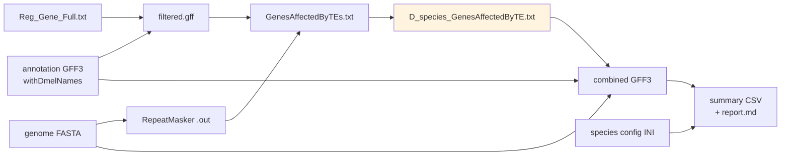

# Data contracts

Every file format that passed between stages, in pipeline order. Examples are taken verbatim
from files in [`../../../evidence/`](../../../evidence/); where a format has a quirk that
matters, it is called out in place.

None of these formats was ever specified anywhere by the lab. They are reconstructed from the
code that reads and writes them and from the surviving files, which is why several of the
"contract points" below are really findings — the format carries an assumption that nothing
records.



---

## 1. Genome FASTA

Standard nucleotide FASTA, one record per chromosome or scaffold, headers being bare NCBI
accessions:

```
>NC_004354.4
```

**Contract points**

- Stage 1 (`worker.sh`) wants these **gzipped** in `IN_DIR`, matched by `GLOB` (default
  `*.fna.gz`). The sample name is the filename with the extension stripped, and it becomes the
  name of every state marker, log and output file for that genome.
- Stage 4's built-in random-access reader expects plain accession headers of exactly the form
  above; it was verified against a 140 MB repeat-masked dm6 FASTA.
- The **seqids here must match column 5 of the RepeatMasker `.out` file and column 1 of the
  annotation GFF3**, or stage 3 silently produces nothing. This is the most common cause of an
  empty result.

---

## 2. Gene annotation GFF3, with *D. melanogaster* names

Standard 9-column GFF3. What makes it special to this pipeline is that gene symbols have been
replaced with *D. melanogaster* ortholog names by the stage 0b renaming step — by one of two
scripts that do not agree with each other, which is why this format is where the largest
finding in the investigation lives (see
[`04-gaps-and-provenance.md`](04-gaps-and-provenance.md), G4).

```
NC_057927.1	Gnomon	gene	848845	850790	.	-	.	Name=Cyp12e1;ID=gene-G00000000064;Name_old=LOC6500252;dbxref=GeneID:6500252;gbkey=Gene;gene=LOC6500252;...
```

**Contract points**

- **Two incompatible producers write this format, and you cannot tell them apart from the
  file alone.** Ayush's `NEW_Step_5_…` rewrites `Name=`; Duy's `ReVamp_Final.py` rewrites
  `ID=` (and `Parent=` to match), leaving `Name=` as it found it. Since downstream matching
  keys on `Name=`, a `final_final` file only works at all because many annotations already
  carry Dmel symbols in `Name=` from `source_gene_common_name` — and where they do not, the
  gene is invisible to stage 3. Roughly 7% of orthologous genes are in that state in every
  `final_final` file. See [`04-gaps-and-provenance.md`](04-gaps-and-provenance.md), G4.
- `Name=` carries the *D. melanogaster* symbol; `Name_old=` preserves the original species
  identifier. Downstream matching keys on `Name=`.
- A single gene may carry **several comma-separated symbols**:
  `Name=Cyp313a5,Cyp313a2,Cyp313a3,Cyp313a1`. This is what triggers the row duplication in
  stage 3a.
- mRNA records carry `dmel_orthologs=` and `hog=N1.HOG…`, showing the ortholog assignment came
  from hierarchical orthogroups.
- **Embedded literal tabs exist inside attribute values** in the surviving example — NCBI
  `model_evidence` and `product` text contains raw tabs rather than `%09`. Anything that splits
  the line on tab and expects exactly 9 fields will see more, and the file is invalid GFF3 by
  that measure. The lab's scripts survive it only because they index columns 0-8 from the left
  and never count fields. `ReVamp_Final.py` is the exception — it drops any line that does not
  split into exactly 9 fields. The tabs were present in the lab's working copies and not in
  the published Zenodo release, so they were introduced somewhere in between.

---

## 3. Cyp target list — `Reg_Gene_Full.txt`

Plain text, one gene symbol per line, 96 lines.

```
Cyp18a1
Cyp314a1
Cyp4g1
```

**Contract points — both surprising**

- **Every line beginning with `D` is skipped**, by both `repeatOpp.py` and `CleanAnnasse.py`.
  This was presumably meant to drop a header or `Dmel\…` prefixed entries; in the surviving
  file it silently discards five real entries: `Dvir\GJ21722`, `Dmoj\GI21254`, `Dvir\GJ21709`,
  `Dvir\GJ22648`, `Dvir\GJ20586`. Effective list length is **91, not 96**.
- **Matching is substring, not exact** — `Rgene in fields[8]`. A short symbol therefore matches
  any longer one containing it. Compare stage 6's xenobiotic list, which matches exactly and
  case-insensitively; the two stages do **not** agree on matching semantics.

---

## 4. RepeatMasker `.out`

Fixed-ish whitespace-aligned columns, two header lines, then one line per repeat hit.

```
   SW   perc perc perc  query           position in query           matching          repeat                position in repeat
score   div. del. ins.  sequence        begin   end        (left)   repeat            class/family      begin   end    (left)     ID

 1079    7.0  0.0 15.2  NW_025319037.1        1     274 (9588158) C rnd-1_family-88   LTR/Pao             (993)    978     815     1
```

Fields, 0-indexed after whitespace splitting — the indices the lab’s code actually uses:

| Idx | Field | Used by |
|---|---|---|
| 0 | Smith-Waterman score | stage 4 (`sw_score`, becomes the GFF3 score column) |
| 1-3 | % divergence, deletion, insertion | stage 4 (`pct_div`/`pct_del`/`pct_ins` attributes) |
| 4 | query sequence id | **stage 3b**, matched against GFF3 column 1 |
| 5, 6 | query begin, end | **stage 3b**, the coordinate test |
| 7 | bases left in query, parenthesised | ignored |
| 8 | strand — `C` for complement, else `+` | stage 4 |
| 9 | matching repeat name | stage 4 (`Name=`) |
| 10 | **repeat class/family** | stage 4 (`repeat_class=`) — **and never filtered on** |
| 11-13 | position in repeat | ignored |
| 14 | RepeatMasker record id | ignored |
| 15 | optional `*` — overlaps a higher-scoring match | ignored |

**Contract points**

- Stage 4 skips any line yielding fewer than 14 whitespace fields, with a warning.
- Column 10 is the one that matters analytically: it distinguishes `LTR/Gypsy` (a real TE) from
  `Simple_repeat` and `Low_complexity` (not TEs). In the surviving *D. ananassae* result
  **69% of retained rows are `Simple_repeat` or `Low_complexity`**, and no stage filters them.
  See [`04-gaps-and-provenance.md`](04-gaps-and-provenance.md).
- These files are large: 39 MB / 297,073 lines for *D. ananassae*.

---

## 5. `filtered.gff` — intermediate, stage 3a → 3b

Raw GFF3 lines copied verbatim from the annotation, restricted to `gene` rows matching a
target symbol. Not a valid standalone GFF3 — no `##gff-version` header.

**Contract point:** contains duplicate rows by construction (166 rows / 91 unique in the
surviving example). Consumers must either de-duplicate or accept inflated counts.

---

## 6. `GenesAffectedByTEs.txt` — intermediate, stage 3b → 3c

Three tab-separated columns:

```
<query seqid> TAB <the gene's entire GFF3 attribute column> TAB <the raw RepeatMasker .out line>
```

Column 2 is the full unmodified attributes blob, often 200+ characters. Column 3 retains the
`.out` line's internal whitespace alignment.

---

## 7. `D_<species>GenesAffectedByTE.txt` — **the narrow waist**

The same three columns, with column 2 collapsed to a bare gene symbol:

```
NC_057927.1	Cyp12e1	 1146  2.0  0.0  2.0  NC_057927.1  850880  850898 (29821857) C rnd-4_family-1983 LTR/Gypsy  (1799)  328  187  62659
```

**This is the contract between the two halves of the project.** Stage 3 writes it; stage 4
reads it as `--te-hits`. Formally:

> `<seqid> TAB <gene symbol> TAB <RepeatMasker .out fields, whitespace-separated>`
> — at least 3 tab-delimited fields, and at least 14 whitespace fields in the third.

**Contract points**

- Rows are commonly repeated 2-3× (inherited from stage 3a). Stage 4 de-duplicates on parse;
  anything else reading this file must do the same.
- Column 1 duplicates the `.out` line's own query seqid. Stage 4 uses column 1 and ignores the
  in-line copy.
- 29 such files exist in `evidence/te-locating-run/AnalysisForAll/output/`. **Their names are
  not machine-parseable** — three are misspelled, and capitalisation of `ByTE`/`ByTe`/`ByT`
  varies. Do not glob on the suffix.

---

## 8. Combined GFF3 — stage 4 → stages 5 and 6

A sorted, valid 9-column GFF3 containing five feature types. This is the format JBrowse loads
and the comparison scripts parse.

| Type | Source column | Key attributes |
|---|---|---|
| `gene` | the annotation's own source | `ID`, `Name=<symbol>`, `gene_biotype` |
| `mRNA` | ″ | `ID`, `Parent`, one representative transcript per gene |
| `exon` | ″ | `ID`, `Parent` |
| `intron` | ″ | derived from the gaps between that transcript's exons |
| `mobile_genetic_element` | `RepeatMasker` | `ID=TE_n`, `Name`, `repeat_class`, `pct_div/del/ins`, **`Description=Within range of <gene>`** |
| `TF_binding_site` | `FIMO/JASPAR` or `FIMO/literature-ARE` | `ID=TFBS_n`, `Name`, `jaspar_matrix_id` **or** `motif_source_id`, `pvalue`, `qvalue`, `matched_sequence`, `Description=… near <gene1>,<gene2>` |

**Contract points — these are what stage 6 depends on**

- `Description=Within range of <symbol>` on TE records is **the only** link between a TE and a
  gene downstream. Stage 6 reads it with `re.compile(r"Within range of (\S+)")` and never
  recomputes overlap. Change this string and the comparisons silently return zero.
- The two motif sources are deliberately distinguishable. JASPAR hits carry
  `jaspar_matrix_id`; the literature CncC:Maf-S motif carries `motif_source_id=CncC_Maf_ARE`
  and a different `source` column, because it is a consensus motif from the literature
  (Veraksa 2000; Misra et al. 2011) rather than an empirical JASPAR PWM. The CncC comparison
  keys on this.
- TE records are always strand-aware; the score column carries the Smith-Waterman score.
- With `--skip-tfbs`, **no `TF_binding_site` records exist at all**. The file is still valid
  and still works for stages 5 and 6's exposure and xenobiotic comparisons.
- `--bgzip-index` additionally produces `.gff3.gz` + `.gff3.gz.tbi` for JBrowse 2.
- `--split-te-track` writes a TE-only GFF3 alongside, for a separate browser track.

---

## 9. Species config INI — stage 6

One section per species. Read by all three comparison scripts.

```ini
[d_suzukii]
gff      = combined_cyp_annotation_suzukii.gff3
exposure = high
gene_name_pattern = ^Cyp
```

| Key | Required | Meaning |
|---|---|---|
| `gff` | yes | Path to that species' combined GFF3 |
| `exposure` | yes | **Must be exactly `high` or `low`** (case-insensitive); anything else is a hard error |
| `gene_name_pattern` | no | Regex restricting which `gene` records count, matched case-insensitively against `Name=`. Only needed when the GFF3 is a whole-genome annotation rather than one already narrowed to Cyp genes |

**Contract points**

- Relative paths resolve against **the config file's own directory**, not the working
  directory, so a config and its data can be moved together.
- A single surrounding pair of quotes is stripped from values — `configparser` does not do
  this itself, and Windows paths containing spaces (such as the ` 1 1` filenames in this
  repository) are routinely quoted by editors.
- The section name is the species label used throughout the reports.

---

## 10. Xenobiotic gene list — stage 6

Plain text, one symbol per line, `#` comments allowed.

**Contract point:** matching is **exact and case-insensitive** — deliberately not substring,
unlike `Reg_Gene_Full.txt`. Paralogs must be listed individually (`Cyp12d1-d` *and*
`Cyp12d1-p`). The script reports unmatched target genes per species, which is the intended
diagnostic for cross-species naming drift.

---

## 11. Outputs — stage 6

| File | Content |
|---|---|
| `--output-csv` | One row per species: `n_cyp_genes`, `n_genes_with_te`, `pct_genes_with_te`, `total_te_count`, `total_cyp_bp`, `te_per_kb`, `te_per_gene` |
| `--per-gene-csv` | One row per gene — the pooled table the tests are actually run on |
| `--output-report` | Markdown: per-species table, Fisher's exact and Mann-Whitney U results, the bootstrap CI, the species-level descriptive comparison, and the pseudoreplication caveat in full |
| `--plot-path` | Bar plot, `te_cyp_by_species.png` by default |

The lab's equivalent was a spreadsheet, `TEandTFdata.xls`, collected into
`Spring26/RM2_RM_TFBS_Results/` *(OCR doc 04)*. **It is not in the archive**, and neither is
any CSV, report or plot — no output of stage 4 or stage 6 survives at all.
