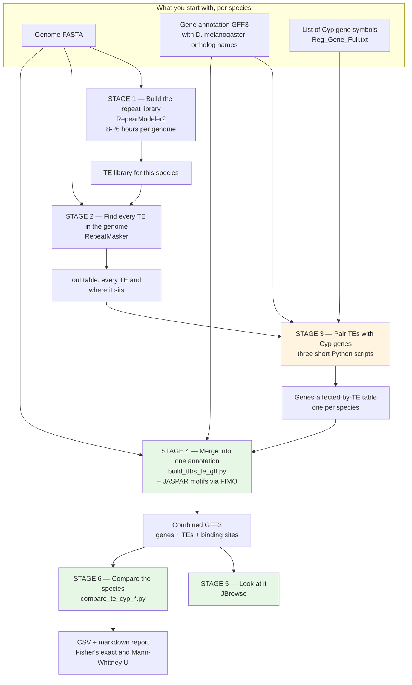
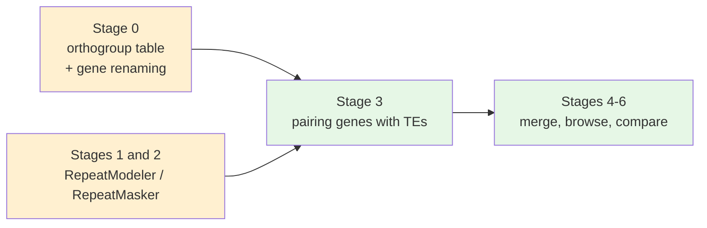

# What this pipeline did

This is a reconstruction. The pipeline described here ran between 2025 and mid-2026 on several
people's Windows machines, was never version-controlled, and no longer exists as a working
whole. What follows is what it did, assembled from the code, data and photographs in
[`../../../evidence/`](../../../evidence/).

## The question

Fruit flies get sprayed with insecticide. Some species live on farmed crops and get sprayed
constantly; others live on wild fruit far from agriculture and essentially never do.

Insects survive insecticide largely by breaking it down, using a family of enzymes called
**cytochrome P450s** — the **Cyp genes**.

**Transposable elements** (TEs, "jumping genes") are stretches of DNA that copy themselves
around a genome. When one lands in or near a gene it can change how strongly that gene is
switched on. The textbook case is *Cyp6g1* in *D. melanogaster*: an element called *Accord*
inserted into the gene's promoter, the gene became over-expressed, and the fly became
DDT-resistant. It happened in the wild and it spread worldwide.

So the question the pipeline exists to answer is:

> **Do heavily-sprayed *Drosophila* species carry more transposable elements in and around
> their Cyp genes than lightly-sprayed ones — and do those elements bring regulatory
> switches with them?**

The lab's own statement of the broader question, from its write-up, is wider still: identify
and compare TEs across *"more than 300 Drosophila genomes"* and determine whether they sit
within or near Cyp genes and carry transcription factor binding sites *(OCR doc 05)*. The code
that survives narrows that to a testable form — and got as far as 29 species.

## The whole thing on one chart

The colours mark something important about this project, explained next.

## Three kinds of stage

Stages 1 to 6 are not the same kind of thing, and it helps to know which is which before
you go looking for code.

| | Stages | What they are | Runtime |
|---|---|---|---|
| 🟦 **Heavy lifting** | 1, 2 | Standard genomics tools — RepeatModeler and RepeatMasker — run inside a Docker container. Nothing here is custom science; it is a long, expensive, unattended computation. | Hours to days *per genome* |
| 🟧 **The join** | 3 | Three short, hand-run Python scripts that take "all the TEs in the genome" and "all the genes" and work out which TEs are near a Cyp gene. This is the narrow waist of the pipeline. | Seconds |
| 🟩 **The analysis** | 4, 5, 6 | Building one merged annotation file per species, looking at it in a genome browser, and running the actual cross-species statistics. | Seconds to minutes |

Stage 1 taking **8 to 26 hours per genome** *(OCR doc 04)* is the single fact that explains
the shape of everything before stage 3. Nobody can sit and watch a run like that, nobody can
afford to lose one to a reboot, and several have to run at once — which is why this half of
the pipeline was a person typing commands into a container for a year, and why it was the
first part anybody tried to replace.

## What survives, and how well

| Stage | What survives |
|---|---|
| **0 — orthogroup table** | ⚠ The tables themselves, and four `Step_*` scripts. **Not** the `config.py` they need, nor the four OrthoFinder post-processing scripts that appear only in a shell history |
| **0b — gene renaming** | ✅ Both scripts, the HOG table, and 25 of 26 outputs. Re-running one of them reproduces the lab's output line for line |
| **1 — RepeatModeler** | ✅ `spinContainer.sh`, matching its photograph exactly, plus the commands from the log |
| **2 — RepeatMasker** | ⚠ `runMasker.sh` was recovered and **contradicts every other source** — it names a GFF where the repeat library should be and has no genome argument. The real command is known only from the notebook and the write-up |
| **3 — pairing genes with TEs** | ✅ All three scripts, twice over, plus one species' complete inputs and outputs and 29 finished tables |
| **4, 6 — merge and compare** | ✅ All four scripts — as a broken OneDrive export in which two of them cannot import the third |
| **5 — JBrowse** | ❌ No script; it was a person clicking. Only the notebook procedure survives |

Two of those rows matter more than the rest.

**Stage 0b is where the investigation went deepest.** Two people wrote two different renaming
scripts and nothing ever chose between them, so the 29 finished species tables are a mix of
both — and one of the two silently drops about 7% of orthologous genes. See
[`../../scripts/06-final-final-gff.md`](../../scripts/06-final-final-gff.md).

**Stage 2's recovered script made things less certain, not more.** Finding `runMasker.sh` was
expected to settle the flag list; instead it contradicted the notebook and the write-up, both
of which agree with each other. See
[`../detailed/02-stage-reference.md`](../detailed/02-stage-reference.md).

The most useful thing in the archive is the worked example under
[`../../../evidence/te-locating-run/`](../../../evidence/te-locating-run/): real
*D. ananassae* inputs *and* the outputs they produced, so the scripts can be checked against
what they actually did. [Following one species](03-following-one-species.md) walks through it.

## Next

- [The pipeline, stage by stage](02-the-pipeline-in-six-stages.md) — each stage in plain language, including the stage-0 divergence
- [Following one species](03-following-one-species.md) — the same path, with real files
- [`../detailed/`](../detailed/) — commands, formats, and what went wrong
- [`../../../evidence/README.md`](../../../evidence/README.md) — where every artifact came from
