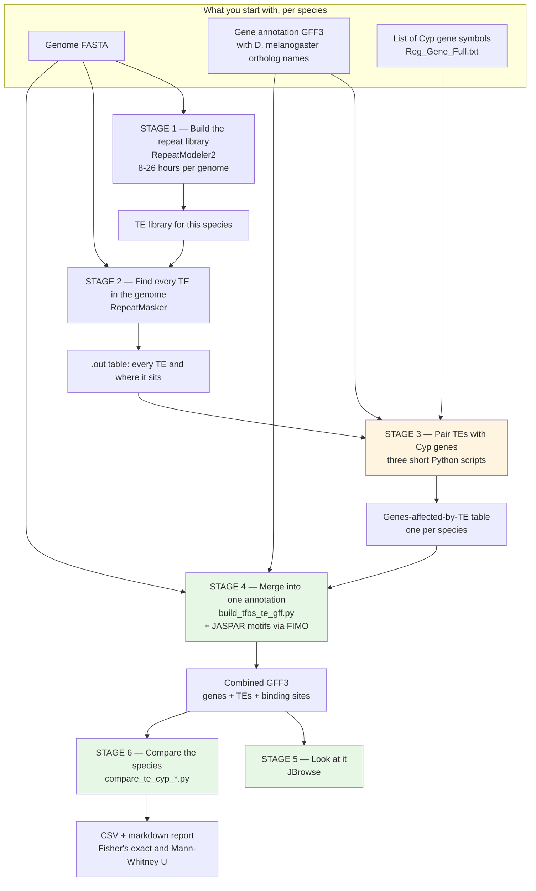
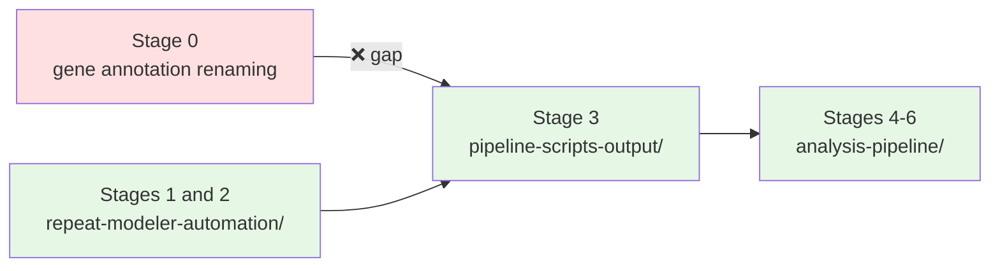

# What this pipeline does

## The question

Fruit flies get sprayed with insecticide. Some species live on farmed crops and get sprayed
constantly; others live on wild fruit far from agriculture and essentially never do.

Insects survive insecticide largely by breaking it down, using a family of enzymes called
**cytochrome P450s** — the **Cyp genes**.

**Transposable elements** (TEs, "jumping genes") are stretches of DNA that copy themselves
around a genome. When one lands in or near a gene it can change how strongly that gene is
switched on. The textbook case is *Cyp6g1* in *D. melanogaster*: an element called *Accord*
inserted into the gene's promoter, the gene became over-expressed, and the fly became
DDT-resistant. It happened in the wild and it spread worldwide.

So the question the pipeline exists to answer is:

> **Do heavily-sprayed *Drosophila* species carry more transposable elements in and around
> their Cyp genes than lightly-sprayed ones — and do those elements bring regulatory
> switches with them?**

The project's own statement of the broader question, from the lab write-up, is wider still:
identify and compare TEs across *"more than 300 Drosophila genomes"* and determine whether
they sit within or near Cyp genes and carry transcription factor binding sites *(OCR doc 05)*.
The code in this repository narrows that to a testable form.

## The whole thing on one chart

The colours mark something important about this project, explained next.

## Three kinds of stage

The six stages are not the same kind of thing, and it helps to know which is which before
you go looking for code.

| | Stages | What they are | Runtime |
|---|---|---|---|
| 🟦 **Heavy lifting** | 1, 2 | Standard genomics tools — RepeatModeler and RepeatMasker — run inside a Docker container. Nothing here is custom science; it is a long, expensive, unattended computation. | Hours to days *per genome* |
| 🟧 **The join** | 3 | Three short, hand-run Python scripts that take "all the TEs in the genome" and "all the genes" and work out which TEs are near a Cyp gene. This is the narrow waist of the pipeline. | Seconds |
| 🟩 **The analysis** | 4, 5, 6 | Building one merged annotation file per species, looking at it in a genome browser, and running the actual cross-species statistics. | Seconds to minutes |

Stage 1 taking **8 to 26 hours per genome** *(OCR doc 04)* is the single fact that explains
the shape of everything before stage 3. You cannot sit and watch a run like that, you cannot
afford to lose one to a reboot, and you need several going at once — so stage 1 in this
repository is a small piece of crash-tolerant infrastructure rather than a script.

## What is actually in this repository

Be aware of this before you try to run anything end to end:

**Every stage from 1 onward has code here.** Stages 1 and 2 are both run by
`repeat-modeler-automation/`, which takes a genome from raw FASTA to a RepeatMasker `.out`
table in one pass.

**The one remaining gap is upstream of all of it**: the step that relabels each species' gene
annotation with *D. melanogaster* ortholog names. That was done by scripts (`ReVamp_Final.py`,
`NEW_Step_5_Replace_gff_Names_with_Dmelanogaster_1_9.py`) that were never committed. They have
since been found in `to_organize/`, and `ReVamp_Final.py` has been re-run and checked — see
[`../../deep/06-final-final-gff.md`](../../deep/06-final-final-gff.md).

In practice: with a genome FASTA you can get all the way to a `.out` table. To go further you
also need an annotation GFF3 for that species with ortholog names already applied — existing
species have one, a newly added species would not.

There is a worked example of stages 3 onward already in the repository —
`pipeline-scripts-output/` contains real *D. ananassae* inputs and outputs, and 29 completed
species tables. [Following one species](03-following-one-species.md) walks through it.

## Next

- [The pipeline in six stages](02-the-pipeline-in-six-stages.md) — each stage in plain language
- [Following one species](03-following-one-species.md) — the same path, with real files
- [`../detailed/`](../detailed/) — commands, formats, failure modes
