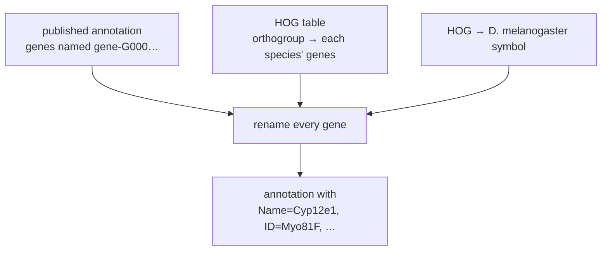
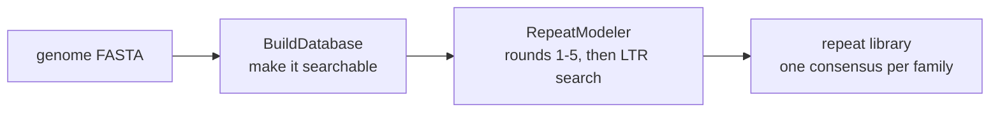
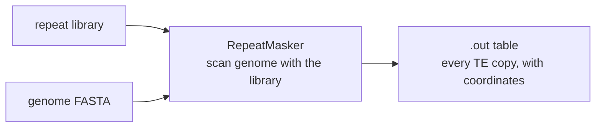
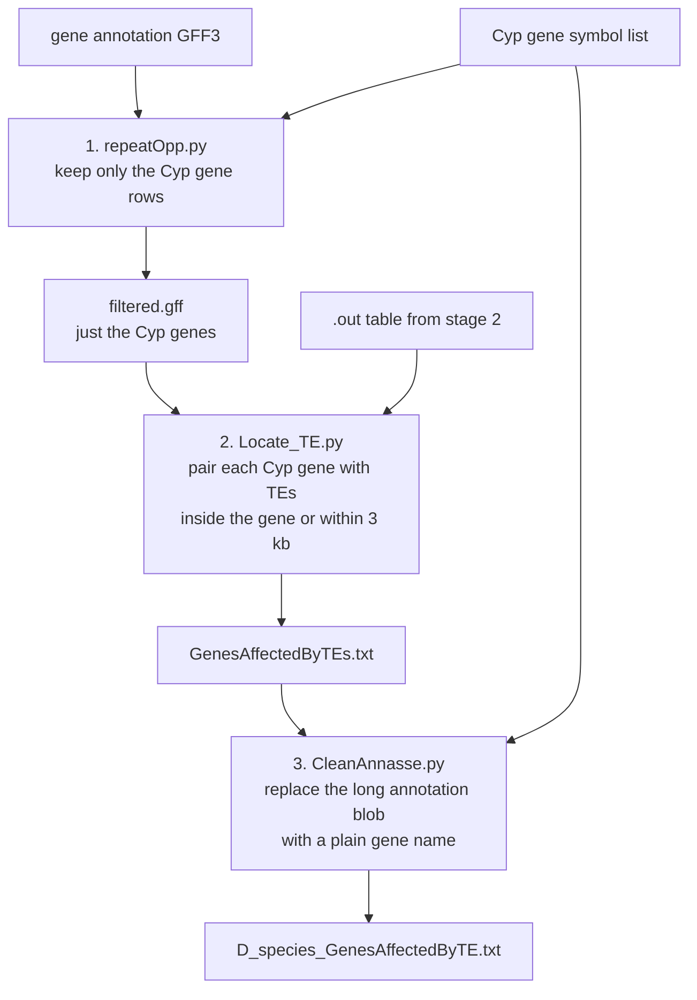
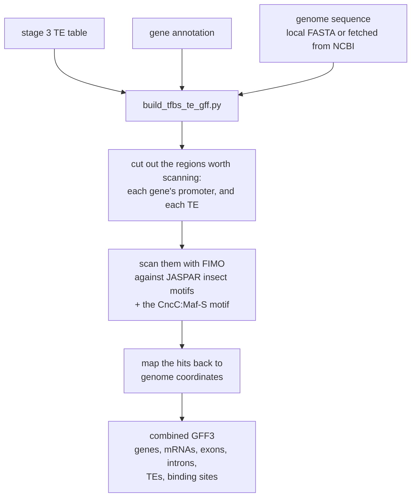
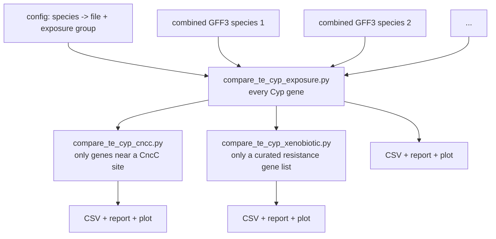

# The pipeline, stage by stage

One stage per section — seven of them, because the preparatory step that everything depends
on is numbered 0. Each says what went in, what came out, and roughly how long it took.
Exact commands, file formats and the evidence behind each claim are in
[`../detailed/02-stage-reference.md`](../detailed/02-stage-reference.md).

---

## Stage 0 — Give every species' genes *D. melanogaster* names

**In:** a published annotation for the species, plus an orthogroup table.
**Out:** the same annotation with gene identifiers replaced by *D. melanogaster* gene
symbols. **Time:** about ten minutes per species.

Nothing in this pipeline can compare species until this has happened. A *D. arizonae* gene is
called `gene-G00000000002` and the *D. ananassae* gene that does the same job is called
something else entirely; only once both are relabelled `Myo81F` can a Cyp gene list written in
*D. melanogaster* names match anything, in any species.

The orthology itself was not computed here — it comes with the published annotations, as
`hog=N1.HOG…` attributes. All this stage does is look up each gene's orthogroup and write the
corresponding *D. melanogaster* symbol in its place.

### Two people wrote this step, twice, and the results differ

This is the single most consequential thing the investigation found, so it is worth stating
plainly here rather than leaving it to the reference documents.

| | **Duy** | **Ayush** |
|---|---|---|
| Script | `ReVamp_Final.py` | `NEW_Step_5_Replace_gff_Names_with_Dmelanogaster_1_9.py` |
| Dataset folder | `Gff_Dataset#2` (7/9/2026) | `Gff_Dataset#1` (5/7/2026) |
| Output files | `change_<SPECIES>_final_final.gff` | `<SPECIES>_final_withDmelNames.gff` |
| How it renames | raw `str.replace` over each whole line, once per gene | parses the attribute column and rewrites fields |
| What it rewrites | `ID=` and `Parent=` | `Name=` |

They were written months apart by two people solving the same problem, and **nothing in the
archive shows anyone ever choosing between them**. The lab log describes both without ranking
them; the lab notebook's step-by-step procedure points at Duy's.

**Duy's version silently loses genes.** Where an orthogroup cell lists more than one gene, the
table stores it quoted and space-separated — `"gene-G00000006376, gene-G00000006377"` — and
`ReVamp_Final.py` splits it on a bare comma. Neither fragment then matches anything in the
annotation, so *no* gene in that cell gets renamed. For *D. arizonae* that is **788 of 11,063
orthologous genes, about 7%**. Ayush's script parses the same cells correctly.

Because the genes that share an orthogroup cell are exactly the ones a species has several
copies of, the losses are not random: they land on multi-copy Cyp clusters. Run the same
*D. ananassae* data through both and Duy's version finds 57 Cyp gene loci where Ayush's finds
91, and two genes — *Cyp28a5* and *Cyp6a19* — disappear entirely.

**And both versions were actually used.** Of the 29 finished species tables, **19 were built
from Duy's output and 7 from Ayush's** (the other three cannot be determined — two are empty
files and one is *D. melanogaster*, which needs no renaming). So the cross-species comparison
at stage 6 sets 19 species whose Cyp gene sets are systematically short against 7 whose are
not — and the difference tracks gene family size, which is the property the study is about.

How each table was attributed, and the full per-gene damage, is in
[`../../scripts/06-final-final-gff.md`](../../scripts/06-final-final-gff.md).

---

## Stage 1 — Build a repeat library for the species

**In:** one genome FASTA. **Out:** a library of every repeat family found in that genome.
**Time:** 8–26 hours, sometimes far longer.

A genome is full of repeated sequence, and most of it is transposable elements. But the
elements in a given species are not known in advance — you have to discover them from the
genome itself. That is what RepeatModeler does: it hunts for sequences that occur many times,
clusters them into families, builds a consensus sequence for each family, and classifies it
(LTR, LINE, DNA transposon, simple repeat, and so on).

Two things about this stage drive the whole project's design:

- **It is slow.** The lab's own figure is 8–26 hours depending on genome size *(OCR doc 04)*.
  One run captured in a screenshot took about 45 hours *(OCR doc 03c)*.
- **It is per-species and embarrassingly parallel.** Nothing about species A's run depends on
  species B's, so the only sane way to process dozens of genomes is to run several at once.

This was done by hand, throughout: open a terminal, start an interactive container, type the
two commands, wait a day, repeat for the next species *(OCR docs 01, 04)*. The container
script that started each session,
[`spinContainer.sh`](../../../evidence/lab-scripts/shell/spinContainer.sh), survives and
matches its photograph exactly. Because it mounts only the current species folder, a second
species meant a second terminal and the whole sequence again.

(In September 2026 this was rebuilt as an unattended worker pair,
`repeat-modeler-automation`. That code is not the lab's and lives in a separate repository;
it is described in [`../../scripts/01-repeat-modeler-automation.md`](../../scripts/01-repeat-modeler-automation.md)
because it is the clearest account of what this stage had to cope with.)

---

## Stage 2 — Find every copy of those repeats in the genome

**In:** the repeat library from stage 1, plus the same genome FASTA.
**Out:** a table of every TE occurrence and its exact coordinates.
**Time:** typically an hour or two.

Stage 1 discovered *what kinds* of element exist. Stage 2 finds *where every copy is*.
RepeatMasker takes the library as a custom search set and scans the genome with it, producing
a line per hit: which chromosome, which start and end position, which strand, which family,
and how divergent that copy is from the family consensus.

RepeatMasker ran **in the same per-species folder as RepeatModeler**, so the library was
already sitting there and nothing had to be copied — the write-up says so explicitly, and the
detail is what makes the rest of the procedure make sense *(OCR doc 05: the library "should
already be there from when we ran RepeatModeler")*.

> **This is the one stage where the evidence conflicts.** A script called `runMasker.sh` has
> been recovered, and it does not match what the lab notebook and the write-up both describe.
> In full it is one line — `RepeatMasker -lib <a gene annotation GFF>` — with no repeat
> library, no genome FASTA and no `-pa`. As saved it could not have produced anything. The
> notebook and the write-up agree with each other and with the shape of the surviving output
> files, so that is what is taken as the real stage 2; what the recovered file was for is an
> open question. See [`../detailed/02-stage-reference.md`](../detailed/02-stage-reference.md).

---

## Stage 3 — Work out which Cyp genes have TEs in or near them

**In:** the `.out` table from stage 2, a gene annotation for the species, and a list of Cyp
gene symbols. **Out:** one table per species of Cyp genes with the TEs that sit in or near them.
**Time:** seconds.

This is the narrow waist of the pipeline — the point where "everything about repeats" and
"everything about genes" finally meet. It is three small Python scripts run one after another:

The distance rule is worth remembering because everything downstream inherits it: a TE counts
as affecting a gene if it falls **within the gene's span extended by 3,000 base pairs at each
end**. That window is meant to catch elements sitting in the promoter, which is exactly where
the *Cyp6g1* / *Accord* case happened.

These three scripts were run **by hand in VS Code**, once per species: open the script, paste
a file path into a specific line, save, click run — three times, with a different path each
time *(OCR docs 02, 05, 06)*. The hardcoded Windows paths still sitting at the top of the
surviving scripts are the residue of that, and the archive preserves the cycle directly:
`Locate_TE.py` exists twice, differing in exactly two lines, both of them paths — one copy set
up for *D. ananassae*, the other for *D. melanogaster*.

Twenty-nine species were completed this way. Three of the twenty-nine output filenames are
misspelled, which is the cost of the method showing through.

---

## Stage 4 — Merge genes, TEs and regulatory motifs into one file

**In:** the stage 3 table, the gene annotation, and genome sequence.
**Out:** one combined GFF3 per species. **Time:** minutes.

Stage 3 produced a plain table. To view it in a genome browser, and to run the comparison,
everything has to become one properly-structured annotation file. That is what
`build_tfbs_te_gff.py` does — and while it has the sequence in hand, it also goes looking for
transcription factor binding sites.

The **CncC:Maf-S** motif is added deliberately on top of the JASPAR set. CncC is the master
regulator of insect detoxification — the switch that turns Cyp genes on in response to a
toxin — so a TE landing next to a CncC site is the most interesting possible case for this
project's question.

Motif scanning can be skipped entirely, which matters later: a species processed without it
has no binding sites in its file, and one of the three comparisons in stage 6 then has
nothing to work with.

---

## Stage 5 — Look at it

**In:** the combined GFF3 and the genome FASTA. **Out:** a genome browser view.

The combined file is loaded into JBrowse as a track against the species' assembly, so a
person can see the TEs, the Cyp genes and the predicted binding sites lined up along the
chromosome. This is how you catch the annotation being wrong in ways statistics will not tell
you about.

This stage is a person clicking, not a script, and **nothing of it survives but the
procedure**: open new genome, choose the FASTA adapter, name the assembly after the species,
then add the track — recorded in the lab notebook *(OCR doc 02)* and the write-up
*(OCR doc 05)*. Sessions were saved for three species only: *D. melanogaster*, *D. simulans*
and *D. sechellia* *(OCR docs 03b, 04)*. None of the saved sessions is in the archive.

---

## Stage 6 — Compare the species and report a verdict

**In:** one combined GFF3 per species, plus a config file saying which species are
heavily-sprayed and which are not. **Out:** a CSV table, a markdown report, and a plot.
**Time:** seconds.

All three run the same two statistical tests, on progressively narrower sets of genes:

- **Fisher's exact test** — does *having at least one TE* go with being in the
  high-exposure group?
- **Mann-Whitney U** — does the *number of TEs per gene* differ between the groups?

They also normalise for the obvious confounder: a species with more, or longer, Cyp genes
would appear to have more TEs simply by having more sequence to hit, so TEs per kilobase and
TEs per gene are reported alongside raw counts.

The reports are candid about the study's main weakness. With only a handful of species, the
test pools individual genes across species and treats each gene as an independent
observation, which it is not — genes in the same species share a genome and a history. Every
report generated says so in plain language rather than burying it.

---

## Next

- [Following one species](03-following-one-species.md) — the same path, with the real
  files from the archive
- [`../detailed/02-stage-reference.md`](../detailed/02-stage-reference.md) — the exact
  commands and parameters for each stage
