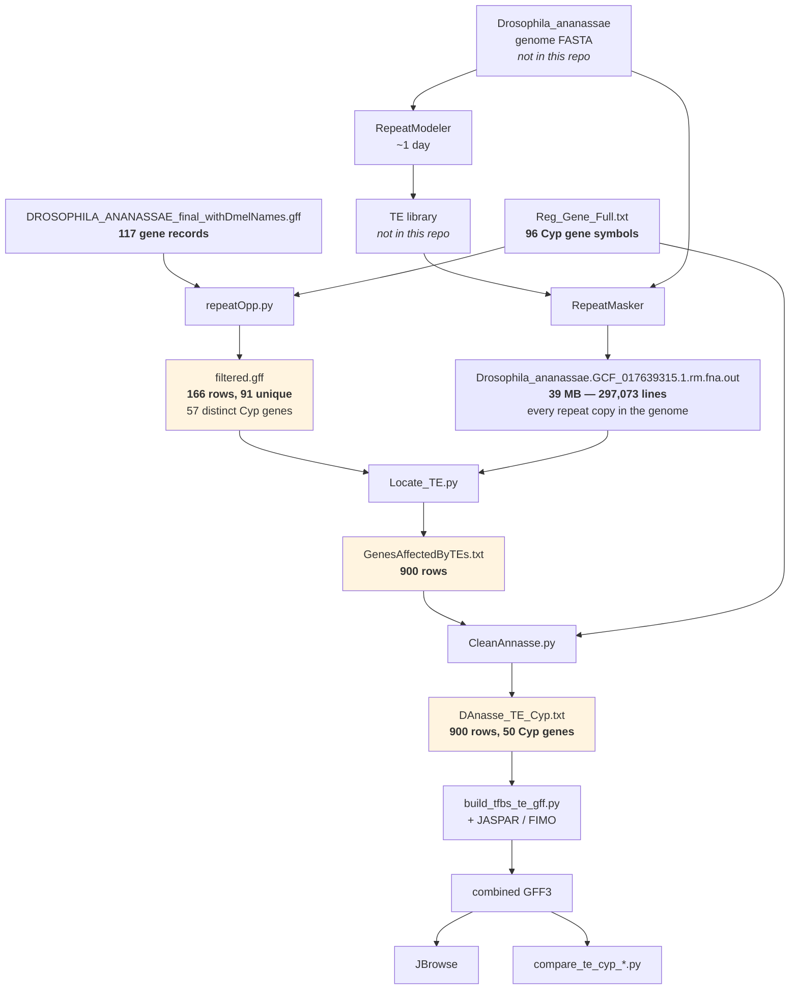

# Following one species end to end

The abstract version of the pipeline is in [the previous document](02-the-pipeline-in-six-stages.md).
This one follows a single real species — ***Drosophila ananassae*** — through the actual files
the lab left behind, in
[`../../../evidence/te-locating-run/`](../../../evidence/te-locating-run/).

Every number below was measured from those files. This is the closest thing the archive has to
a specification: real inputs and the real outputs they produced, so each script can be checked
against what it actually did rather than what it looks like it does.

## The journey in one picture



## Step by step

### Start: 297,073 repeats and 117 genes

Stages 1 and 2 have already happened. What they left behind is
`DA_Files/Drosophila_ananassae.GCF_017639315.1.rm.fna.out` — a 39 MB RepeatMasker table with
**297,073 lines**, one per repeat copy found anywhere in the genome. A typical line says: this
repeat family, on this chromosome, from here to here, on this strand, this far diverged from
the family consensus.

Alongside it is `DA_Files/DROSOPHILA_ANANASSAE_final_withDmelNames.gff` — the gene annotation,
already relabelled so that *D. ananassae* genes carry their *D. melanogaster* ortholog names.
That relabelling is what makes cross-species comparison possible at all: without it, the same
gene has a different name in every species. It contains **117 gene records**.

> **The copy in the archive is truncated** — one chromosome, ending mid-line — so it is not
> what the results below were made from; they span six chromosomes. `filtered.gff` *is*
> consistent with the full file, and re-running the last two steps from it reproduces the
> archived outputs exactly. The truncation looks like a copy that was interrupted, not like
> anything the pipeline did.

The third input is the target list, `AnalysisForAll/Reg_Gene_Full.txt` — **96 Cyp gene
symbols**, one per line, `Cyp18a1`, `Cyp314a1`, `Cyp4g1` and so on.

### Step 1 — keep only the Cyp genes (`repeatOpp.py`)

Reads the annotation, keeps a row only if it is a `gene` record whose attributes mention one
of the 96 target symbols. Result: **`filtered.gff`, 166 rows**.

Note the arithmetic: 117 gene records in, 166 rows out. The script writes one row per *matching
symbol*, so a gene whose annotation lists four Cyp names —
`Name=Cyp313a5,Cyp313a2,Cyp313a3,Cyp313a1` — is written out four separate times. Of the 166
rows only **91 are unique**, covering **57 distinct gene names**.

This duplication is not cosmetic: it propagates. Every duplicated gene row causes the next
step to re-emit all of that gene's TE hits again. The stage 4 script knows this and
de-duplicates on the way in — its own documentation notes the format *"commonly repeats
identical rows 2-3x"* — so whoever wrote that script **observed the symptom without tracing
the cause**. Any count taken from the intermediate files directly is inflated.

### Step 2 — pair genes with TEs (`Locate_TE.py`)

For each Cyp gene row, scan all 297,073 repeat records and keep those falling inside the
gene's span extended by **3,000 bp at each end**. Result: **`GenesAffectedByTEs.txt`, 900 rows**,
each one `chromosome → the gene's full annotation blob → the repeat's RepeatMasker line`.

The 3 kb margin is the interesting parameter. It is there to catch elements in the promoter —
the *Cyp6g1* / *Accord* situation, where the element sits upstream of the gene rather than
inside it.

### Step 3 — make it readable (`CleanAnnasse.py`)

The second column of that file is an unreadable 200-character annotation blob. This script
swaps it for the bare gene symbol. Result: **`DAnasse_TE_Cyp.txt`, 900 rows across 50 distinct
Cyp genes**, and it looks like this:

```
NC_057927.1	Cyp12e1	 1146  2.0  0.0  2.0  NC_057927.1  850880  850898 (29821857) C rnd-4_family-1983 LTR/Gypsy  (1799)  328  187  62659
```

Chromosome, gene, then the repeat: an *LTR/Gypsy* element, 19 bp of it, sitting just past the
end of *Cyp12e1*.

This file is the **handoff point**. It is exactly the format stage 4 expects as `--te-hits`,
and it is where the hand-run half of the pipeline ends and the analysis code in
`evidence/analysis-scripts/` begins. It is also the last point at which anything is
recoverable: the 3 kb rule and the paralog collapse are both baked in by now, written into the
file rather than recorded as parameters.

### One thing to know before trusting the counts

Of those 900 rows, here is what the repeats actually are:

| Repeat class | Rows |
|---|---|
| `Simple_repeat` | 502 |
| `Unknown` | 136 |
| `Low_complexity` | 118 |
| `RC/Helentron` | 67 |
| `LTR/Gypsy` | 19 |
| `LINE/CR1` | 15 |
| `RC/Helitron` | 9 |
| `DNA/TcMar-Tc1` | 9 |
| everything else | 25 |

**About 69% of them — the simple repeats and low-complexity regions — are not transposable
elements at all.** They are microsatellites and AT-rich stretches. RepeatMasker reports them
because it is a repeat finder, not a TE finder.

Nothing in the pipeline filters them out. The repeat class is carried faithfully all the way
into the combined GFF3 as a `repeat_class=` attribute, but neither the merge step nor any of
the three comparison scripts ever looks at it. So "TE burden" as this pipeline currently
measures it is mostly a measure of simple-repeat content.

That may be fine — if simple repeats are distributed evenly it adds noise rather than bias —
but it is not what the research question asks about, and it is worth deciding deliberately
rather than inheriting by accident. It is recorded as an open issue in
[`../detailed/04-gaps-and-provenance.md`](../detailed/04-gaps-and-provenance.md).

### Steps 4 to 6 — and then the same thing 28 more times

From here the species-specific work is done. `build_tfbs_te_gff.py` turns the table into a
combined GFF3 with binding sites attached, JBrowse displays it, and the comparison scripts
read one such file per species.

*D. ananassae* is not alone: `AnalysisForAll/output/` holds **29 completed species tables**,
from `D_algonquinGenesAffectedByTE.txt` to `D_willistoniGenesAffectedByTE.txt` — each one the
product of somebody opening three scripts in VS Code, pasting in three paths, and clicking run
three times.

You can see the cost of that in the filenames themselves:
`D_secheliaGenesAffectedByT.txt`, `D_athabascaGenesAfffectedByTE.txt`,
`D_arawakanaGenesAffectedByTe.txt`. Twenty-nine hand-typed filenames, three of them
misspelled. Two more — `D_eugracilisGenesAffectedByTE.txt` and
`D_paulistorumGenesAffectedByTE.txt` — are **zero bytes**: the file was created and the run
produced nothing, and nothing in the archive records why.

The 29 are not even all the same pipeline. Nineteen were built from one gene-renaming script
and seven from the other, and the two do not agree —
[`../../scripts/06-final-final-gff.md`](../../scripts/06-final-final-gff.md) works out which
is which, and what it costs.

## Next

- [`../detailed/02-stage-reference.md`](../detailed/02-stage-reference.md) — the exact commands
- [`../detailed/03-data-contracts.md`](../detailed/03-data-contracts.md) — every file format above, specified
- [`../detailed/04-gaps-and-provenance.md`](../detailed/04-gaps-and-provenance.md) — what all of this means for the numbers
