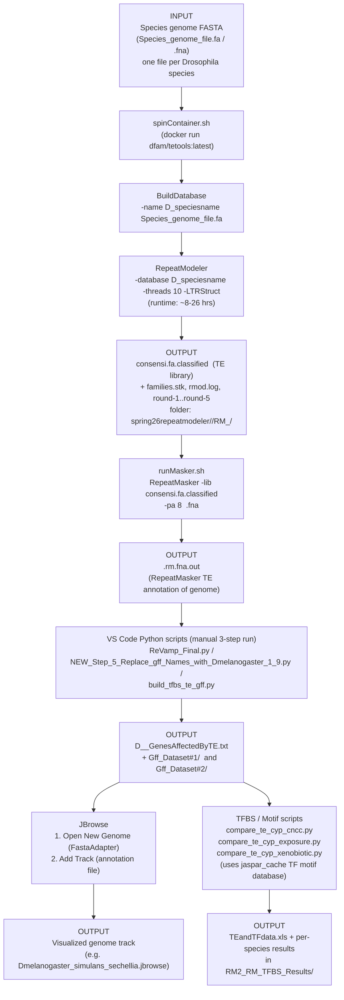

# CYP Gene Project — TE Analysis Pipeline: Flowchart

> **Superseded.** Written in September 2026 from the seventeen archive photographs alone,
> before any of the lab's own code had been recovered. Kept as part of the record. Several of
> its reconstructions have since been contradicted by the recovered files — see
> [`../README.md`](../README.md). The current account is
> [`docs/pipeline/`](../../pipeline/).

Source: reconstructed from photos of terminal/file-explorer screenshots, a handwritten lab
notebook, a typed "Atallah Lab Spring 2026 Log," and D. Kaur's write-up
"Development and Use of Bioinformatics Scripts for Transposable Element Analysis in Drosophila."
See `3_Pipeline_Detailed.md` for exact commands, full paths, and notes on illegible/uncertain
handwriting.

## Stage-by-stage table

| # | Stage | Script / Tool | Run from / location | Input | Output |
|---|-------|---------------|----------------------|-------|--------|
| 1 | Spin up TE-modeling container | `spinContainer.sh` (runs `docker run dfam/tetools:latest`) | `.../Spring26/spring26repeatmodeler/<species>/` | Species genome FASTA (`Species_genome_file.fa`) | Interactive shell inside `dfam/tetools` container, working dir mounted at `/Spring26RepeatModeler` |
| 2 | Build searchable genome DB | `BuildDatabase -name D_speciesname Species_genome_file.fa` | inside container, species folder | Genome FASTA | `D_speciesname.*` database files |
| 3 | Model repeat/TE library | `RepeatModeler -database D_speciesname -threads 10 -LTRStruct` | inside container | Database from step 2 | `consensi.fa.classified` (TE library), `families.stk`, `rmod.log`, `round-1`…`round-5` folders |
| 4 | Mask/annotate genome with TE library | `runMasker.sh` → `RepeatMasker -lib consensi.fa.classified -pa 8 <species>.fna` | RepeatMasker working folder (same tree, per species) | `consensi.fa.classified` + genome FASTA | `<species>.rm.fna.out` (TE locations/classifications) |
| 5 | Build/repair GFF annotation (rename genes to D. melanogaster orthologs, merge TE + gene data) | `ReVamp_Final.py` (Duy) or `NEW_Step_5_Replace_gff_Names_with_Dmelanogaster_1_9.py` (Ayush's edit) or `build_tfbs_te_gff.py`, run manually in VS Code | `CYP_Gene_Project/Spring26/...` and `Summer26/JBrowse_gff_creator/` | GFF dataset file + RepeatMasker `.out` file (paths pasted in manually each run) | `D_<species>_GenesAffectedByTE.txt`; datasets saved to `Gff_Dataset#1/` or `Gff_Dataset#2/` |
| 6 | Visualize | JBrowse (Open New Genome → Add Track) | JBrowse desktop app | Genome FASTA + annotation file from step 5 | `.jbrowse` session file (e.g. `Dmelanogaster_simulans_sechellia.jbrowse`) |
| 7 | TFBS / motif comparison vs. CYP genes | `compare_te_cyp_cncc.py`, `compare_te_cyp_exposure.py`, `compare_te_cyp_xenobiotic.py` | `Summer26/JBrowse_gff_creator/` | Annotation output from step 5 + JASPAR TF motif data (`jaspar_cache/`) | `TEandTFdata.xls` and related results in `RM2_RM_TFBS_Results/` |

**Note on ambiguity:** the exact contents of `runMasker.sh` and the three GFF/Python scripts were not directly visible in the photos (only referenced by name, or shown via a hand-copied command). Command syntax above is reconstructed from a handwritten paraphrase and may not be byte-for-byte accurate — verify against the actual script files before treating this as executable documentation.
